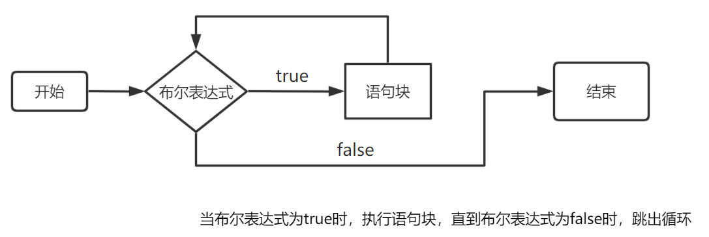
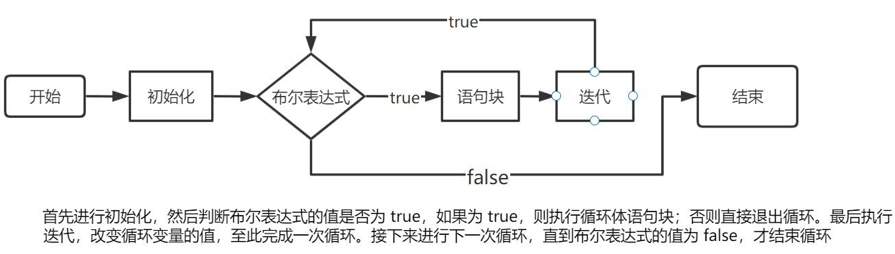

*Writen by 周子未*
```table-of-contents
title: 
style: nestedList # TOC style (nestedList|nestedOrderedList|inlineFirstLevel)
minLevel: 0 # Include headings from the specified level
maxLevel: 0 # Include headings up to the specified level
includeLinks: true # Make headings clickable
hideWhenEmpty: false # Hide TOC if no headings are found
debugInConsole: false # Print debug info in Obsidian console
```
# 代码规范
1. 初学时可以使用`#include <bits/stdc++.h>`(万能头文件)
2. 左括号可换行可不换行(如`{`,老师要求换行)
3. 不能有两个连续空行,独立的代码块之间要有空行;头文件块`#include`,函数,全局变量块等必须用空行隔开.
4. 空格的作用:识别族群的位置.
>前后必须都有空格: 冒号`:`,双目运算符`+`, `-`, `&`, `|`, `>>`, ...,三目运算符`?`.
>前加后不加: 地址与指针运算符(目前未学).
>后加前不加: 关键字`if`,`return`,`while`,`for`, ...(会特殊高亮)以及逗号,分号等.
>前后都不加`.`,`->`,`::`,以及单目运算符`!`,`-`,`++`,`--`.

5. 注意**缩进**,同一逻辑层下的代码缩进要相同.
## 代码示例
```cpp
#include <bits/stdc++.h>
using namespace std;

int main()
{
	int x, cnt = 0, notPri[505], pri[505];
	memset(notPri, 0, sizeof notPri);
	notPri[0] = notPri[1] = 1;
	
	cin >> x;
	
	for (int i = 2; i < 505; i++)
	{
		if (!notPri[i]) pri[++cnt] = i;
		for (int j = 1; j <= cnt && i * pri[j] < 505; j++)
		{
			notPri[i * pri[j]] = 1;
			if (i % pri[j] == 0) break;
		}
	}
	
	cout << (notPri[x] ? "合数" : "质数") << endl;
}
```

# 分支
## if语句
`if`和`else`语句符合**就近原则**,每一块语句都以`if`开头.注意每个`else if`/`else`是属于哪个`if`.
另外,同组的`if`,`else if`,`else`永远只会执行一个.
其他要注意的点只有跟着代码在脑海中走一遍逻辑,不要遗漏和重复即可.
```cpp
int x = 5;
if (x <= 10) cout << 1 << " ";
if (x <= 100) cout << 2 << " ";
if (x <= 5) cout << 3 << " ";
else if (x <= 50) cout << 4 << " ";
if (x <= 1) cout << 5 << " ";
else if (x <= 3) cout << 6 << " ";
else cout << 7 << " ";
```
> 输出
1 2 3 7
### 例: 输入一个坐标(x,y)求该点在第几象限或在哪个半轴
```cpp
int x, y;
cin >> x >> y;
if (x > 0) // 1.1
	if (y > 0) cout << "第一象限" << endl; // 2.1
	else if (!y) cout << "x正半轴" << endl; // 2.2
	else cout << "第四象限" << endl; // 2.3
else if (x < 0) // 1.2
	if (y > 0) cout << "第二象限" << endl; // 3.1
	else if (!y) cout << "x负半轴" << endl; // 3.2
	else cout << "第三象限" << endl; //3.3
else // 1.3
	if (y > 0) cout << "y正半轴" << endl; //4.1
	if (!y) cout << "原点" << endl; // 4.2
	else cout << "y负半轴" << endl; // 4.3
return 0;
```
## switch语句
`switch`语句基于不同的条件执行不同的代码块.
```cpp
switch (表达式) {
	case 标签1:
		// 代码块1
		break; // 可选
	case 标签2:
		// 代码块2
		break; // 可选
	case 标签3:
		// 代码块3
		break; // 可选
	default:
		// 默认代码块
}
```
以下有几个注意事项:
1. `表达式`的值必须是整形(`int`,`char`),或能够转化为整形的类型(`short`,`long`).
2. `case`和它所对应的值`标签n`一起被称为case标签,case标签必须是**整形常量**表达式.同时,任何两个case标签的值不能相同.
```cpp
int n = 5;
switch (n) {
	case 3.14: // 错误
	case n: // 错误
	case 5: // 正确
	case 5: // 多写这一行就会报错
}
```
3. 如果任何一个case标签(无论**在`default`之前还是之后**)都不能匹配`表达式`的值,程序才会匹配`default`并执行其后的语句.
4.  如果某个case标签或`default`匹配成功,程序将从该标签开始往后顺序执行**所有**switch分支的代码块(无论是否是`default`分支),除非程序**显式中断**了这一过程(`break`).有时候可以利用这个特性设计代码.
```cpp
switch (2) {
	case 1: cout << 1 << " ";
	case 2: cout << 2 << " ";
	case 3: cout << 3 << " ";
	default: cout << 5 << endl;
	case 4: cout << 4 << " ";
}
```
>输出
>2 3 5 4

5. 一般习惯将`default`放在最后,此时其后的`break`可以省略.
6. 如果希望匹配某一标签但不做任何操作,需要在标签后加一条空语句,即`case 0: ;`或`default: ;`.
7. C++程序的形式比较自由,当几个case标签写在一起且中间没有`break`时,可以将这几个标签写在一行里,代表这个分支匹配的是某个范围内的值.
```cpp
char c;
cin >> c;
switch (c) {
	case 'a': case 'b': case 'd':
		cout << 'Y' << endl;
		break;
	default:
		cout << 'N' << endl;
}
```
>如果输入是a或b或d,则输出`Y`,否则输出`N`.
### 例: 输入成绩[0,100],输出等级(85-100:A;60-84:B;0-59:C)
```cpp
int n;
cin >> n;
switch ((n < 60) + (n < 85)) {
	case 0:
		cout << "A" << endl;
		break;
	case 1:
		cout << "B" << endl;
		break;
	case 2:
		cout << "C" << endl;
		break;
}
```
# 循环
## while循环

```cpp
while (布尔表达式) {
	// 语句块
}
// 后续语句
```
## 死循环
上述代码中如果`布尔表达式`恒为真,循环永远不会自己结束,即形成了死循环.
如``while(1){}``就是一种死循环的写法.
但是我们可以通过`break`和`continue`控制循环的进行.
`break`用于**终止**当前循环体,并执行循环外的后续语句.
`continue`用于跳过本次循环的未执行的语句,接着立即进行是否执行下一次循环的判定.它**不会结束**当前循环.
```cpp
while (1) {
	AAA;
	if (XXX) break;
	if (YYY) continue;
	BBB;
	if (ZZZ) break;
}
CCC; // 后续语句
```
上述代码中按时间顺序:
1. 每次循环先执行`AAA`语句.
2. 如果某次循环满足`XXX`则直接结束循环,接着执行循环外的`CCC`.
3. 如果某次循环不满足`XXX`而满足`YYY`,则不执行本次循环中的`BBB`直接开始下一次循环.
4. 执行`BBB`语句.
5. 如果满足`ZZZ`,结束循环并执行`CCC`.
6. 开始下一次循环.
注意`break`只会结束**当前层**的循环体,所以下面的代码中外层循环永远不会结束.
```cpp
while (1) {
	int x = 1;
	while (1) {
		if(x == 5) break;
		x++;
	}
}
```
## do...while循环

```cpp
do {
// 语句块
} while (布尔表达式);
```
`do...while`永远会**执行一次**语句块,无论`布尔表达式`是否为真.
其他细节与`while`类似.
## for循环

```cpp
for (初始化; 布尔表达式; 迭代){
	// 语句块;
}
```
在上述代码中:
1. 无论`布尔表达式`是否为真,都会**执行一次**`初始化`.
2. 循环结束的条件为`布尔表达式`为假.
3. 每次循环除了会执行一次`语句块`,还会再执行一次`迭代`.
4. 如果省略`布尔表达式`,即`for(初始化; ; 迭代){}`,则默认`布尔表达式`为真,循环永远不会结束.

不难得出像下面这样写`for`循环也是等价的:
```cpp
初始化;
for (; ;) {
	if (!布尔表达式) break;
	语句块;
	迭代;
}
```
## 循环的嵌套
所有循环类型都是可以互相嵌套的.比如下面的代码:
```cpp
while (1) {
	int n, sum = 0;
	cin >> n;
	for (int i = 1; i <= n; i++)
		sum += i;
	cout << sum << endl;
}
```
循环被嵌套时,每执行一次外层循环,都会完整地执行**一整轮**内层循环,且除非执行内层循环时修改了某一变量的值,否则所有变量的值都**不会改变**.
内层循环执行完一整轮后,再执行外层循环的剩余部分和下一次外层循环.
```cpp
for (int i = 1; i <= 5; i++) {
	// 每一整轮内部循环执行时i的值都不改变
	for (int j = 1; j <= i; j++)
		cout << j << " ";
	cout << endl; // 注意由于内层循环未加括号,这一行是属于外层循环的
}
// i = 1时执行一轮内部循环,
// i = 2时执行一轮内部循环,以此类推
```
>输出
>1
>1 2
>1 2 3
>1 2 3 4
>1 2 3 4 5
## for循环的套路
`for`循环的优势在于行数少,可读性强,以下为`for`循环的几个经典写法.
### 套路1: 从1到n的循环
```cpp
for (int i = 1; i <= 5; i++) {
	cout << i << endl;
	// 总共进行i次循环,i的值从1到n
	
	// int x = i;
	// 如果非要用修改过的i的值计算
}
```
>输出
>1 2 3 4 5

一定不要**直接修改循环变量**`i`的值(会影响循环执行),如果非要用修改后的值计算,请在循环内部加入`int x = i;`再将`x`当作`i`来修改.

上述循环等价于:
```cpp
int k = 1;
while (k <= n) {
	cout << k << endl;
	// 此处可进行有关k的计算
	k++;
}
```
注意`for`的**圆括号**里定义的变量是长期**临时变量**,只能在该循环的花括号内使用,但每一次循环中变量值的变化会被保存.该循环体全部执行完后自动注销.
另`for`的**花括号**内定义的变量是短期**临时变量**,每一次循环结束都会自动注销.
```cpp
for (int i = 1; i <= n; i++) {
	// i只能在花括号里使用,且在循环体内,i的值的改变会被保存
	int n = 0; // 每次i的值改变时都会重新定义n = 0
}
cout << i << endl; //这样会报错
```
>报错
>'i' was not declared in this scope
>// i未在此范围内声明
### 例: 计算[1,n]上所有奇数的平方的和
```cpp
int sum = 0;
for (int i = 1; i <= n; i += 2) {
	sum += i * i;
}
cout << sum << endl;
```

### 套路2: 取x的各个位上的数
$x\%10$是$x$个位上的数字,而$x'=\lfloor x/10\rfloor$(向下取整)相当于直接丢掉$x$个位上的数字,此时$x'\ \%10$($x'$的个位数字)就是原来$x$的十位数字...不断重复这个过程即可.
```cpp
for (; x; x /= 10) {
	cout << x % 10 << endl; // x % 10 就是x当前位的数字
}
```
等价于
```cpp
while (x) {
	cout << x % 10 << endl;
	x /= 10;
}
```
### 例: 输入数x,将x各个位倒序输出
>输入
>12334
>输出
>4 3 3 2 1
```cpp
int a[15], k = 0, x;
cin >> x;
for (; x; x /= 10) {
	a[++k] = x % 10; // k用于记录当前到第几位了
}
for (int i = 1; i <= k; i++) 
 cout << a[i] << " ";
```
# 数组常用套路
## 一维数组的定义
数组用于存储**多个相同类型**的元素,它本质上是连续内存空间的集合;
```cpp
int N = 10;
int a[100];
int b[5] = {2, 1, 3, 5, 4};
// b[0] = 2,b[1] = 1,b[3] = 3,依此类推
char c[N];
```
以下有几个注意事项:
1. **数组序号从0开始**,`int a[10]`所定义的数组能使用的范围为`a[0]~a[9]`.
2. 由于数组的本质是连续内存空间的集合,所以`int a[10]`之后就算写出`a[-1]`,`a[10]`也不一定会报错,但是结果肯定是错的.
3. 在`main()`函数里定义的数组(及单个变量)如果不赋初始值会被**随机赋值**.
```cpp
int x, a[10];
cout << x << " " << a[0] << endl;
// 以上两个都会输出随机值
```
### 例: 输入n(n<=20),再输入n个正整数,求其中的最小值和它是第几个数,有多个最小值时优先输出序号小的
```cpp
int n, a[25], im = 100000, k;
// 因为im要不断跟数组里的最小值比较,所以初值必须非常大;
cin >> n;
for (int i = 1; i <= n; i++) cin >> a[i];
for (int i = 1; i <= n; i++)
	if (im > a[i]) im = a[i], k = i; // k为序号
cout << a[i] << " " << k << endl;
```
如果优先输出序号大的,只需将上述第6行进行如下修改`想想为什么`
```cpp
	if (im >= a[i]) im = a[i], k = i;
```
## 二维数组的定义
二维数组`a[n][m]`可想象成一个$n$行$m$列的矩阵,但行列的**初始序号为0**.
比如`int a[2][3];`所对的6个元素`a[i][j]`:

| |$j=0$|$j=1$|$j=2$|
| --- | --- | --- | --- |
| $i=0$| $a[0][0]$| |
| $i=1$| | | $a[1][2]$|
### 例: 输入n,m(n,m<=10)并给定一个n\*m的矩阵,输出其转置
```cpp
int n, m, a[15][15], b[15][15];
cin >> n >> m;
for (int i = 1; i <= n; i++)
	for (int j = 1; j <= m; j++)
		cin >> a[i][j];
for (int i = 1; i <= m; i++) // 交换m和n的位置
	for (int j = 1; j <= i; j++)
		b[i][j] = a[j][i];
for (int i = 1; i <= m; i++) {
	for (int j = 1; j <= n; j++)
		cout << b[i][j] << " ";
	cout << endl;
}
```
### 例: 给定一个5\*5的矩阵,将其强行转化为上三角矩阵
>输入
>1 2 3 4 5
>5 4 3 2 1
>1 1 1 1 1
>2 2 2 2 2
>3 3 3 3 3

>输出
>1 2 3 4 5
>0 4 3 2 1
>0 0 1 1 1
>0 0 0 2 2
>0 0 0 0 3

我们发现当`i`越大,`j`越小,且`i + (-j)`大于某定值时`a[i][j] = 0`.
```cpp
int a[5][5];
for (int i = 0; i < 5; i++)
	for (int j = 0; j < 5; j++)
		cin >> a[i][j];
for (int i = 0; i < 5; i++)
	for (int j = 0; j < 5; j++)
		if (i + (4 - j) >= 5) a[i][j] = 0;
for (int i = 0; i < 5; i++) {
	for (int j = 0; j < 5; j++)
		cout << a[i][j] << " ";
	cout << endl;
}
```
# 字符串常用套路
## ASCII码
char类型保存的是字符的**ascii码**值.
```cpp
char c = '0', s = 67;
cout << (int)c << " " << s << endl;
```
>输出
>48 C
## 用字符数组做字符串处理
```cpp
char c, s[25];
c = getchar(); // 输入一个字符
for (int i = 0; i < 10; i++) s[i] = getchar();
putchar(c); // 将字符变量c输出
for (int i = 0; i < 5; i++) putchar(s[i]);
cin.getline(s, 20, ' '); // 为s读取19个字符直至读取到空格
// 等等
```
此处不展开,可以直接看学习通或者上网搜索相关资料.**一定要弄懂**因为考试可能会考到.
## C++封装的字符串处理
c++封装了变量类型`string`用于处理字符串.`string`的用法与其他的变量类型相同.
只有在读到换行`\n`和空格` `等字符时,才会结束当前`string`变量的输入.
```cpp
string s1, s2, s3; // 类似int的定义方式
cin >> s1 >> s2 >> s3;
cout << s1 << " " << s2 << " " << s3 << endl;
```
输入
>12$%,8 !:\n()p
>abc0x7f
>
>输出
>12$%,8 !:\n()p abc0x7f

`string s1`所定义的变量本身就是一个字符串,而不是`char`所定义的单个字符.
所以,如果`string s1;`的`s1`不为空,那么就可以用`s1[i]`这样的方式输出`s1`的第$i$个字符.(**序号从0开始**)
### string的常用函数
`string`内部字符的编号是从0开始的.
```cpp
string s = "", s1 = "123";
cout << s.empty() << " " << s1.empty() << endl; // 如果s为空s.empty()返回1否则返回0
cin >> s >> s1; // 重新输入s和s1的值
cout << s.size() << endl; // 字符串s的长度,以前也写作s.length()
for (int i = 0; i < s.size(); i++) cout << s[i] << " "; // 按数组方式输出字符
cout << endl;
cout << s.substr(1, 3) << endl; // 输出s位置1~3上的子串
if (s.find(s1) != string::npos) cout << s.find(s1) << endl;
else cout << -1 << endl;
// s.find(s1)用于寻找s1在s中出现的位置,如果没有出现则返回特殊值string::npos
s += s1; cout << s << endl; // string重载了+号,a + b表示将b拼接在a后面
cout << (s == s1) << " " << (s1 == "34") << endl;
// string重载了==号,若两个字符串完全相等则返回真,否则返回假
// 等等更多内置函数
```
>输入
>12345 34

>输出
>1 0
>5
>1 2 3 4 5
>234
>2
>1234534
>0 1

一般情况下**尽可能使用**`string`类型而不是`char[]`数组(不会被换行`\n`和空格` `字符干扰).
如果在做C++实验的时候题目要求定义字符数组`char a[n];`,但是我们想使用`string`,那么按要求定义`char[]`数组但不使用即可.
### 例: 输入一个字符串,如果是形如`https://A.com/`格式(A只能是英文字母和数字组成的字符串,长度6~10),则输出"YES",否则输出"ERR"
*这部分代码可能比较难看懂*
再次注意如果`s`不为空,其内部的所有字符为`s[0]~s[s.size() - 1]`而非`s[1]~s[s.size()]`.
```cpp
char a[23]; // 定义但不使用
string s, s1 = "https://", s2 = ".com";
cin >> s;
if (s.size() < 18 || s.size() > 22) {
	cout << "ERR" << endl;
	return 0;
}
for (int i = 0; i < 8; i++)
	if (s[i] != s1[i]) {
		cout << "ERR" << endl;
		return 0;
	} // 确认前缀
for (int i = 0; i < s2.size(); i++)
	if (s[s.size() - 1 - i] != s2[s2.size() - 1 - i]) {
		cout << "ERR" << endl;
		return 0;
	} // 确认后缀
for (int i = 8; i < s.size() - 5; i++)
	if ((s[i] < 65 || s[i] > 90) && (s[i] < 97 || s[i] > 122) && (s[i] < 48 || s[i] > 57)) {
		cout << "ERR" << endl;
		return 0;
	} // 确认A是否只由数字字母组成
cout << "YES" << endl;
```
当然上例的各个部分可以用内置函数简化,此处不展开.
# 解决问题的思想
## 问题的拆解
### 例: 输入数n,求[1,n]上质数的个数
有时候问题并不是一步就能解决的,需要把问题**拆解成更小的问题**逐个解决.
对于上面这个问题,我们先来看给定一个数$x$,怎么判断是不是质数.
假设$x$不是质数,那么一定可以被分解成$x=a\times b\ (a,b\in N_+且a,b\geq2)$.
同时$a,b$中至少有一个小于等于$\sqrt{x}$.`为什么?`
所以判断$x$是不是质数时,只需要从$2$枚举到$\sqrt{x}$,如果$x$被其中任意一个数整除,那么$x$不是质数,反之$x$是质数.
```cpp
int x;
cin >> x;
bool pri = 1;
for (int i = 2; i * i <= x; i++)
	if (x % i == 0) {
		pri = 0;
		break;
	}
if (pri == 0) cout << "NO" << endl;
else cout << "YES" << endl;
```
回过头来看原问题,我们只需要对$[2,n]$上的每一个数执行上述的过程即可.
```cpp
int n, s = 0;
cin >> n;
for (int i = 2; i <= n; i ++) {
	int pri = 1; // 注意定义变量的位置,花括号里定义的变量只能在花括号里的本次循环中使用;
	// 即每次i的值改变(即循环进行一次),上一次的变量pri都会自动注销,并新定义一个pri = 0.
	for (int j = 2; j * j <= i; j ++)
		if (i % j == 0) {
			pri = 0;
			break;
		}
	if (pri == 1) s++;
	//if(pri == 0) cout << i << " ";
	// 假如需要输出有哪些质数,将上面一行取消注释.
}
cout << s << endl;
```
### 例: 输入10个数,将它们从大到小输出
>题目意思就是将输入的数字排序,排序有很多种思路,这里介绍一种.

从大到小输出用另一种说法就是,先输出最大的,再输出第二大的,...
如果我们找到了最大的数,并将其拿走,那么原第二大数的就变成新的最大的数,问题又转化为在新的序列中寻找最大的数.
所以还是先看怎么找出最大的数和它的位置:
```cpp
int k, iM = -100000; // 题目中没说输入为正整数
for (int i = 0; i < 10; i++)
	if (im < a[i]) iM = a[i], k = i;
```
那么我们如何实现将第$i$大的数拿走的操作呢?
只需要每次将第$i$大的数与第$i$个数`a[i]`交换,接着再寻找`a[i+1]`到`a[n]`中最大的数$p$,此时$p$必定为第$i+1$大的数.
我们再将$p$与`a[i+1]`交换,不断重复这个操作即可.
```cpp
int a[15];
for (int i = 0; i < 10; i++) cin >> a[i];
for (int i = 0; i < 10; i ++) {
	int k = i, iM = -100000; // k赋初值防止越界(本写法可不赋值,但编译器会警告)
	for (int j = i; j < 10; j++)
		if (iM < a[j]) iM = a[j], k = j;
	// 交换a[i]和a[k](a[k]为最大值)
	int p = a[k];
	a[k] = a[i];
	a[i] = p;
}
for (int i = 0; i < 10; i++) cout << a[i] << " ";
cout << endl;
```