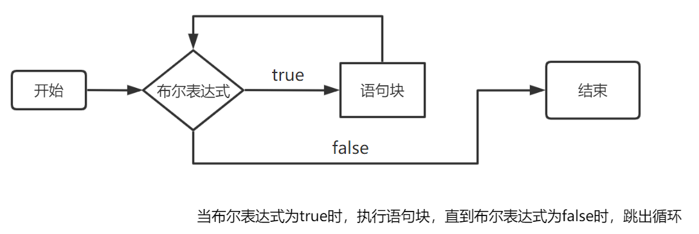
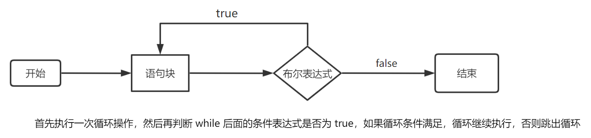
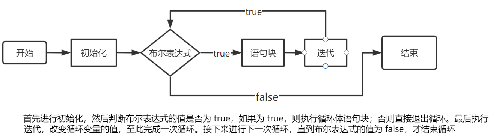

*Writen by 周子未*
```table-of-contents
title: 
style: nestedList # TOC style (nestedList|nestedOrderedList|inlineFirstLevel)
minLevel: 0 # Include headings from the specified level
maxLevel: 0 # Include headings up to the specified level
includeLinks: true # Make headings clickable
hideWhenEmpty: false # Hide TOC if no headings are found
debugInConsole: false # Print debug info in Obsidian console
```
# 代码规范
1. 初学时可以使用`#include <bits/stdc++.h>`(万能头文件)
2. 左括号可换行可不换行(如`{`,老师要求换行)
3. 不能有两个连续空行,独立的代码块之间要有空行;头文件块`#include`,函数,全局变量块等必须用空行隔开.
4. 空格的作用:识别族群的位置.
>前后必须都有空格: 冒号`:`,双目运算符`+`, `-`, `&`, `|`, `>>`, ...,三目运算符`?`.
>前加后不加: 地址与指针运算符(目前未学).
>后加前不加: 关键字`if`,`return`,`while`,`for`, ...(会特殊高亮)以及逗号,分号等.
>前后都不加`.`,`->`,`::`,以及单目运算符`!`,`-`,`++`,`--`.

5. 注意**缩进**,同一逻辑层下的代码缩进要相同.
## 代码示例
以下代码仅用作格式参考,无需看懂代码逻辑.
```cpp
#include <bits/stdc++.h>
using namespace std;

int main()
{
	int x, cnt = 0, notPri[505], pri[505];
	memset(notPri, 0, sizeof notPri);
	notPri[0] = notPri[1] = 1;
	
	cin >> x;
	
	for (int i = 2; i < 505; i++)
	{
		if (!notPri[i]) pri[++cnt] = i;
		for (int j = 1; j <= cnt && i * pri[j] < 505; j++)
		{
			notPri[i * pri[j]] = 1;
			if (i % pri[j] == 0) break;
		}
	}
	
	cout << (notPri[x] ? "合数" : "质数") << endl;
}
```

# 作用域
在C++中,一个变量被声明后并不是在任何地方都可以被使用的,需要满足以下两个条件:
1. 使用变量的语句在声明变量的语句之后.
```cpp
int main() {
	cin >> x; // 报错
	int x;
}
```
2. 使用变量的语句必须处于声明变量的语句所处的**作用域之内**.

目前可以理解为每个花括号都对应了一个局部作用域,比如下面的代码,`作用域3`在`作用域2`之中,`作用域2`在`作用域1`之中.`作用域3`里可以使用`作用域1`里已经声明的变量,反过来却不可行.
```cpp
int main() {
	// 作用域1
	int n;
	cin >> n;
	for (int i = 1; i <= n; i++) {
		// 作用域2
		if (i % 2) {
			// 作用域3
			int t = n - i; // 内部可以使用外部已经声明的变量n
		}
	}
	// 如果要在此处使用变量t比如cout << t << endl;会报错
}
```
具体地来说C++实现了部分的内存管理,当花括号结束时内部声明的所有变量都会被**销毁**以释放内存,被销毁的变量自然就无法使用了.

而在主函数`int main() {}`的花括号外还存在一个全局作用域.全局作用域下声明的变量会自动初始化为默认值(如`int`型为`0`,`char`型为`\0`).反之在局部作用域声明的变量可能会被**随机赋初值**(视具体编译器而定).
```cpp
#include <bits/stdc++.h>
using namespace std;

int global;
int main() {
	int x, a[10];
	cout << global << " " << x << " " << a[0] << endl;
	// 以上x和a[0]都可能为随机值,但global一定是0
	return 0;
}
```
>输出
>0 782054832 485930211

局部作用域中声明的变量为**局部变量**,全局作用域中声明的为**全局变量**.


# 命名空间
在C++中,命名空间`namespace`是一种封装标识符(如类型,函数,变量等)的机制,用于防止不同库中的**相同名称**产生冲突.
## 定义命名空间
我们可以使用`namespace`关键字来定义一个命名空间.
`namespace`关键字只能在**全局作用域**中使用,且任意命名空间下的成员都视作在全局作用域中.
```cpp
namespace A { // 定义名为A的命名空间
	int a;
	void welcome() {
		std::cout << "welcome home." << std::endl;
	}
}
```
要访问命名空间中的成员,需要使用作用域解析运算符`::`.
```cpp
namespace A {
	int a = 10;
}
namespace B {
	int a = -10;
}

int main() {
	std::cout << A::a << " " << B::a << std::endl;
}
```
>输出 10 -10

## 访问命名空间
使用`using`访问命名空间的特定成员:
```cpp
using A::a;
using std::cout;
cout << a; // 无需再解析作用域
```
>输出 10

使用`using`引入整个作用域:
```cpp
using namespace std;
using namespace A;
cout << a << endl; // 命名空间std和A下的所有成员都可以直接访问
```

## 特殊的命名空间
1. 全局命名空间: 所有不在任何命名空间中的标识符都位于全局命名空间中(可直接使用).
2. `std`命名空间: 标准库`STL`是C++语言的核心部分,C++标准库中几乎所有的类和函数都被定义在`std`命名空间之中,它包含了大部分的C++标准库功能,如输入/输出(`cin`,`cout`),数据结构,算法等,用以减少全局命名冲突.

所以一份C++代码的基础结构如下:
```cpp
#include <bits/stdc++.h>
using namespace std;

int main() {
	return 0;
}
```
3. 匿名命名空间: 匿名命名空间中的成员可以直接使用,但使用范围限制在本文件内.
```cpp
namespace {
	int a;
	void f() {}
	// 匿名命名空间中的成员不能在其他文件中被访问
}
```

## 命名空间的其他特性
### 嵌套命名空间
```cpp
namespace A {
	namespace B {
		namespace C {
			int n = 10;
		}
	}
}

int main() {
	std::cout << A::B::C::n << std::endl;
}
```

### 命名空间别名
```cpp
using namespace std;
int main() {
	namespace T = A::B::C;
	cout << T::n << endl; // 使用T来指代A::B::C
}
```

# 输入输出
## 输入输出函数
C语言使用`scanf()`函数输入,`printf()`函数输出.
C++使用`cin`输入,`cout`输出,基本形式为`cin >> a >> b`,`cout << a << ' ' << b;`.
事实上C++保留了C中的输入输出函数,即C++中可以用`scanf()`,`printf()`,也可以使用`getchar()`读取单个字符,`putchar()`输出单个字符,等等更多函数.

### cin与cout
当我们想输入一个值时,必须有一个地方来记录这个值,这个地方就是**内存**,而记录这个位置的值就是**地址**.声明一个变量(如`char c`)就是在内存里给这个变量分配一个空间,所以只有**变量才具有地址**,只有变量的值才能被改变.

`cin`使用`>>`连接各个元素,它本质上就是读取键盘的输入并以此修改各个变量的值(其中不能有常量),这也是为什么`cin >> a >> ' ' >> b`或类似的写法是错误的.
`cout`使用`>>`连接各个元素,它将某些值输出到显示器上,不管这个值是否有地址.所以`cout << a << ' ' << 5 << endl`的写法是可行的. 

`cin`与`cout`同属于`<iostream>`库,且都位于`std`命名空间中,所以其使用方法为:
```cpp
#include <iostream>
// using namespace std;
int main() {
	int a, b;
	std::cin >> a >> b;
	std::cout << a << " " << b << std::endl; 
}
```
在头文件的下一行加入`using namespace std;`以省略`std::`.

## ASCII码
计算机采用的**ascii 码值**读取与保存键盘输入的字符.
```cpp
char c = '0', s = 67;
cout << (int)c << " " << s << endl;
```
>输出 48 C

`cin`会根据要读入的变量类型自动将输入的字符转换成其本值或其ascii码对应值.
```cpp
int x; char y;
cin >> x >> y;
cout << x << " " << y << endl;
```
>输入 0 0
>输出 0 48

## 输入缓冲区
事实上,`cin`虽然是用来读取键盘上的输入,但并不是每输入一个字符程序就立刻读取并执行,而是敲下回车键<kbd>Enter</kbd>时将这一整行一起读入.

这是因为C++一般采用的是**行缓冲**的缓冲方法,键盘输入单个字符时并不直接被程序读取,而是先进入输入缓冲区,直到输入回车字符`\n`程序才会开始从缓冲区读取这一行的数据(将这一行缓冲区内容标记为可读).

你可能会注意到程序执行到输入函数但我们迟迟不进行输入的情况下它不会继续往下执行,而是会等待我们输入,这种函数也叫做**阻塞函数**.

### cin与输入缓冲区
我们输入的任何字符**包括特殊字符**都会直接进入输入缓冲区.但按下回车后这一行内容才能被程序读取.对于如下代码:
```cpp
int a, b, c;
cin >> a >> b >> c;
return 0;
```
当我们进行如下输入:
>45 8
>&nbsp;&nbsp;6 (6前面有个空格)

敲下第一行的回车后可读的输入缓冲区变为`45' '8\n`(`' '`为空格,`\n`为回车).
`cin`从可读缓冲区(以下均用缓冲区指代)读取一个变量的的具体过程是:
1. 将开头的所有特殊字符**忽略并清除**出缓冲区.
2. 读取缓冲区里的一连串字符直到遇见特殊字符(` `和`\n`等),将读取到的这串字符(**不包括**最后的特殊字符)从缓冲区清除并将其值写入变量.

也就是说,没敲下回车时,程序将等待我们输入(可读的缓冲区为空).当我们敲下第一个回车,缓冲区变为`45' '8\n`,程序开始从缓冲区里读取数据.读入变量`a`时,程序从缓冲区读取到`48`将其清除并写入`a`,缓存区还剩`' '8\n`.

接下来程序尝试读入`b`,首先读取到空格` `忽略并清除,缓冲区还剩`8\n`.然后读取到`8`清除并写入`b`,缓冲区还剩`\n`.

最后程序尝试读入`c`,首先读取到`\n`忽略并清除,此时可读的缓冲区变为空.直到我们敲下第二个回车,可读的缓冲区增加为`' '6\n`,程序读取到空格` `忽略并清除,接着读取到`6`清除并写入变量`c`,缓冲区变为`\n`.

此时三个变量都成功读取,输入过程结束并执行下一语句`return 0`,程序结束缓冲区全部清空.也就是说直到程序结束前缓冲区都剩下了`\n`没有读完.

### getchar()
`getchar()`的用法为`x = getchar()`,默认返回值为`char`类型,即输入字符的ascii码值.`getchar()`的缓冲方式也是行缓冲,每次尝试从可读缓冲区读取单个字符并清除,**不会忽略特殊字符**(缓冲区第一个字符是什么就返回什么).
### cin.fail()
我们来看如下代码:
```cpp
int x = 5, y = 5;
char c;
cin >> x >> y;
c = getchar();
cout << x << " " << y << " " << c << endl;
```
>输入
>(换行)
>k 10(换行)

>输出
>0 5 k(换行)

感觉是不是不太对?
我们首先输入`int`型的变量`x`,读取到了`char`型的字符`k`,那么`x`的值应该为`k`(或者`k`的ascii码值),接着读取到`y`的值为`10`,`c`的值为`\n`才对.输出为什么会是`0 5 k\n`?

事实上,当`cin`尝试读入某一类型的变量但从缓冲区读取的数据并不是该类型时,`cin.fail()`值将会被设为`true`,表示**输入流出错**(但可以挽回),这时被读取到的数据将不会从缓冲区中清除并且接下来所有的`cin`都将被直接跳过直到我们使用`cin.clear()`将错误标志复位.

在上述代码中,敲下第一行的回车后缓冲区变为`\n`,程序尝试读入`x`读取到`\n`忽略并清除,缓冲区变为空,继续等待输入.敲下第二行空格时,可读的缓冲区增加为`k' '10\n`,程序继续读入`x`读取到字符`k`,由于类型不对`cin.fail()`被设为真,字符`k`将不会从缓冲区中被清除并且读入`x`和`y`的行为将被跳过(并且由于输入`x`时出现错误,`x`的值被设为`int`型的默认值`0`),缓冲区维持`k' '10\n`不变.最后`c = getchar()`尝试从缓冲区读取一个字符,读到字符`k`清除并把字符变量`c`的值设为`k`.那么最后缓冲区还剩下`' '10\n`,程序结束.

### cin.clear(),cin.ignore()和cin.peek()
当`cin`出现错误时,我们可以使用`cin.clear()`重置错误标志并继续使用`cin`.
由于出现错误时错误的数据并不会被从缓冲区里清除,我们还需使用`cin.ignore()`主动清除缓冲区里的数据.`cin.ignore()`用法如下:
```cpp
cin.ignore(x); // 清除缓冲区接下来x个字符
cin.ignore(x, c); // 清除缓冲区的字符直到数量为x,或者遇到字符c
```
使用第二种方式时包括遇到的字符`c`在内也会被清除出缓冲区.请看如下代码:
```cpp
int x; char y;
cin >> x;
if (cin.fail()) {
	cin.clear();
	cin.ignore(100, ' '); // 清除缓冲区字符直至100个或者遇到空格
}
y = getchar(); // ignore()将空格也清除了否则y的值将为空格
cin >> x;
cout << x << " " << y << endl;
```
>输入
>kkkkk p 80

>输出
>80 p

程序先从缓冲区`kkkkk' 'p' '80\n`中读入`x`,读入失败缓冲区不变.此时使用`cin.clear()`复位错误标志,并且清除缓冲区里的$100$个字符直到遇见空格` `(包括空格).清除完后缓冲区还剩`p' '80\n`,程序读取到单个字符`p`清除并赋值给变量`y`,缓冲区变为`' '80\n`.最后读入`x`的值为`80`.

`cin.peek()`则是在不清除缓冲区的前提下返回缓冲区第一个字符的结果(**`char`型**):
```cpp
int x;
if(cin.peek() < '0' || cin.peek() > '9') // 若缓冲区第一个字符不为0~9之间的数字
	cin.ignore(1); // 清除缓冲区的一个字符
cin >> x;
cout << x << endl;
```
>输入 n4 | 输出 4

`cin.peek()`可以帮助我们提前判断输入的数据会不会使`cin`出错,并且结合之后学的循环可以直接剔除错误的数据`while(cin.peek()...) cin.ignore(1);`.

## 输出缓冲区
类似输入缓冲区,C++中也设置了输出缓冲区.当程序输出数据时,数据先写入输出缓存区,然后在适当的时候一次性刷新到目标设备(显示器).
数据从输出缓冲区刷新到目标设备时,为了保证不会重复输出,同时会将其从缓冲区中清除.当然我们也可以手动清除缓存.
```cpp
std::cout << std::flush; // 调用flush刷新缓冲区并打印到目标设备
std::cout.flush(); // 等价的另一种写法
std::cout << std::endl; // endl会做两件事: 1.换行 2.刷新缓存区并打印
// endl等价于
std::cout << '\n' << std::flush;
```
如果只是换行且不需要即时输出,优先用`\n`,因为它性能更好.
在需要即时输出(例如进度条,日志)或程序中断前需要确保输出完整时,使用`endl`.
不过在大多数情况下,尤其是默认的交互式输出场景(如终端输出),`\n`和`endl`的效果是相似的,因为标准输出流`std::cout`在默认情况下启用了行缓冲模式,遇到换行符`\n`时会自动刷新缓冲区.
>为什么没有`\n`或`flush`,输出依然立即显示?
>在交互式环境下(如终端),`std::cout`的行为与非交互式环境不同,表现为一种特殊的缓冲模式(近似无缓冲).这种优化是为了提高用户体验,因为用户通常希望在终端中立即看到输出.

感兴趣可参考这篇文章[C/C++：缓冲区（buffer）_c++缓冲区-CSDN博客](https://blog.csdn.net/m0_61515267/article/details/145203400).

## cout的格式控制
### 成员函数
1. `cout.precision()`返回当前精度,`cout.precision(n)`设置精度为`n`,控制该语句后所有浮点数输出.
2. `cout.width()`返回当前字段宽度,`cout.width(n)`设置字段宽度为`n`,只影响下一句输出.
3. `cout.fill(c)`用字符`c`填充空白,只影响下一句输出.
4. `cout.put(c)`输出单个字符,只能用于输出字符型常量或变量.
### 格式化标志
`cout.setf()`用于设置格式,`cout.unsetf()`用于清除格式,控制该语句后所有输出.用法为`cout.setf(flag, field)`和`cout.unsetf(flag, field)`,表示清除`field`**域下的格式化标志**并且设置被清除的标志为`flag`.
如果省略`field`参数,则仅在该域**未设置**格式化标志时才将其设置为`flag`.

`flag`是格式化标志,可以是下面的常量之一:

| 常量 | 说明 |
| --- | --- |
| `ios::boolalpha` | 将`bool`值输出为`true`或`false` |
| `ios::dec` | 以十进制输出整数 |
| `ios::oct` | 以八进制输出整数 |
| `ios::hex` | 以十六进制输出整数 |
| `ios::left` | 左对齐 |
| `ios::internal` | 居中对齐 |
| `ios::right` | 右对齐 |
| `ios::showbase` | 输出整数时显示前缀`0`,`0x`或`0X` |
| `ios::showpoint` | 显示小数点 |
| `ios::showpos` | 在正数前面显示`+`号 |
| `ios::skipws` | 具体输入操作前跳过空白字符 |
| `ios::unitbuf` | 每次输出后都清空缓存区 |
| `ios::uppercase` | 将字母字符输出为大写 |
| `ios::fixed` | 以固定精度输出浮点数(固定位小数) |
| `ios::scientific` | 以科学计数法输出浮点数 |

`field`是域标志,可以是下面的常量之一:

| 常量 | 说明 |
| --- | --- |
|`ios::basefield`| 适用于`dec`,`oct`,`hex` |
| `ios::adjustfield` | 适用于`left`,`internal`,`right` |
| `ios::floatfield` | 适用于`scientific`,`fixed` |

```cpp
int x = 10;
cout.width(5); // 设置输出宽度为5
cout << x << endl;
cout.unsetf(ios::dec); // 清除默认的十进制标志
cout.setf(ios::hex); // 设置输出为十六进制
// 或者更规范的写法 cout.setf(ios::hex, ios::basefield);
cout.setf(ios::left, ios::adjustfield); // 设置左对齐
cout << x << endl;
```
>输出
> &nbsp;&nbsp;&nbsp; 10
>a&nbsp;&nbsp;&nbsp;&nbsp;

### 输出操纵符
操纵符是令代码能以`<<`或`>>`控制输入/输出流的帮助函数.
对于上一节的所有格式化标志`flag`,如果`flag`不含于任意域`field`中,则可以用`<< flag`设置格式,`<< noflag`清除格式,比如:
```cpp
int x = 10;
std::cout << std::showpos << x << " ";
std::cout << std::noshowpos << x; // 注意操纵符的命名空间为std而不是ios
```
>输出 +10 10

如果`flag`含于任意域`field`中,则只能用`<< flag`清除原格式并设置新格式.
```cpp
int x = 10;
std::cout << std::hex << x << " "; // 十六进制
std::cout << std::dec << x; //十进制
```

其他可用的操作符还有: (详情参见[zh.cppreference.com_输入/输出操纵符](https://zh.cppreference.com/w/cpp/io/manip))

| 操作符 | 作用 |
| --- | --- |
| `std::ws` | **用于输入流**,舍弃输入的前导空格 |
| `std::flush` | 清除输出缓存区并打印至设备 |
| `std::endl` | 输出`\n`后执行`flush` |
| `std::setfill(c)` | 更改填充字符为`c`,可以通过<br />`std::cout.fill()`获得当前填充字符 |
| `std::setprecision(n)` | 更改浮点数精度为`n` |
| `std::setw(n)` | 更改**下次**输入输出字段的宽度 |

# 分支
## if语句
`if`和`else`语句符合**就近原则**,每一块语句都以`if`开头.注意每个`else if`/`else`是属于哪个`if`.
另外,同组的`if`,`else if`,`else`永远只会执行一个.
其他要注意的点只有跟着代码在脑海中走一遍逻辑,不要遗漏和重复即可.
```cpp
int x = 5;
if (x <= 10) cout << 1 << " ";
if (x <= 100) cout << 2 << " ";
if (x <= 5) cout << 3 << " ";
else if (x <= 50) cout << 4 << " ";
if (x <= 1) cout << 5 << " ";
else if (x <= 3) cout << 6 << " ";
else cout << 7 << " ";
```
> 输出
1 2 3 7
### 例: 输入一个坐标(x,y)求该点在第几象限或在哪个半轴
```cpp
int x, y;
cin >> x >> y;
if (x > 0) // 1.1
	if (y > 0) cout << "第一象限" << endl; // 2.1
	else if (!y) cout << "x正半轴" << endl; // 2.2
	else cout << "第四象限" << endl; // 2.3
else if (x < 0) // 1.2
	if (y > 0) cout << "第二象限" << endl; // 3.1
	else if (!y) cout << "x负半轴" << endl; // 3.2
	else cout << "第三象限" << endl; //3.3
else // 1.3
	if (y > 0) cout << "y正半轴" << endl; //4.1
	if (!y) cout << "原点" << endl; // 4.2
	else cout << "y负半轴" << endl; // 4.3
return 0;
```
## switch语句
`switch`语句基于不同的条件执行不同的代码块.
```cpp
switch (表达式) {
	case 标签1:
		// 代码块1
		break; // 可选
	case 标签2:
		// 代码块2
		break; // 可选
	case 标签3:
		// 代码块3
		break; // 可选
	default:
		// 默认代码块
}
```
以下有几个注意事项:
1. `表达式`的值必须是整型(`int`,`char`),或能够转化为整型的类型(`short`,`long`).
2. `case`和它所对应的值`标签n`一起被称为case标签,case标签必须是**整型常量**表达式.同时,任何两个case标签的值不能相同.
```cpp
int n = 5;
switch (n) {
	case 3.14: // 错误
	case n: // 错误
	case 5: // 正确
	case 5: // 多写这一行就会报错
}
```
3. 如果任何一个case标签(无论**在`default`之前还是之后**)都不能匹配`表达式`的值,程序才会匹配`default`并执行其后的语句.
4.  如果某个case标签或`default`匹配成功,程序将从该标签开始往后顺序执行**所有**switch分支的代码块(无论是否是`default`分支),除非程序**显式中断**了这一过程(`break`).有时候可以利用这个特性设计代码.
```cpp
switch (2) {
	case 1: cout << 1 << " ";
	case 2: cout << 2 << " ";
	case 3: cout << 3 << " ";
	default: cout << 5 << endl;
	case 4: cout << 4 << " ";
}
```
>输出
>2 3 5 4

5. 一般习惯将`default`放在最后,此时其后的`break`可以省略.
6. 如果希望匹配某一标签但不做任何操作,需要在标签后加一条空语句,即`case 0: ;`或`default: ;`.
7. C++程序的形式比较自由,当几个case标签写在一起且中间没有`break`时,可以将这几个标签写在一行里,代表这个分支匹配的是某个范围内的值.
```cpp
char c;
cin >> c;
switch (c) {
	case 'a': case 'b': case 'd':
		cout << 'Y' << endl;
		break;
	default:
		cout << 'N' << endl;
}
```
>如果输入是`a`或`b`或`d`,则输出`Y`,否则输出`N`.
### 例: 输入成绩[0,100],输出等级(85-100:A;60-84:B;0-59:C)
```cpp
int n;
cin >> n;
switch ((n < 60) + (n < 85)) {
	case 0:
		cout << "A" << endl;
		break;
	case 1:
		cout << "B" << endl;
		break;
	case 2:
		cout << "C" << endl;
		break;
}
```

## 三目运算符
### 基本使用
三目运算符的基本形式如下:
```cpp
条件 ? 表达式1 : 表达式2;
```
三目运算符可以被表述为如下的`if`条件语句:
```cpp
if(条件) {
	表达式1;
}
else {
	表达式2;
}
```
如果`条件`为真则整个式子等价于`表达式1`,否则等价于`表达式2`:
```cpp
int a, b = 0, c = 1 ? a = 3 * 5 : b = 2 * 10;
// 完全等价于
int a, b = 0, c = (a = 3 * 5);
cout << a << " " << b << " " << c << endl;
```
>结果
>15 0 15

### 三目运算符求值
一个好习惯是所有三目运算表达式外都加上圆括号`()`,然后从内往外不断地依靠`条件`的判断求得表达式的值,比如下式:
```cpp
条件1 ? (条件2 ? 表达式1 : (条件3 ? 表达式2 : 表达式3)) : (条件4 ? 表达式4 : 表达式5);
```
若已知`条件3`为假,`条件4`为真则化为:
```cpp
条件1 ? (条件2 ? 表达式1 : 表达式3) : 表达式4;
```
进一步若`条件2`为假则化为:
```cpp
条件1 ? 表达式3 : 表达式4; // 最基本的形式
```

### 例:给出三个正整数a,b,c,输出其中第二大的数
用三目运算符书写分支语句的重点是理清**自然逻辑**.可以用纸笔辅助思考.
以下展示一种比较复杂的思路(想清每一步有助于于锻炼思维):
假设我们现在有三个数$a,b,c$,那么:
1. $a\leq b$的情况下: 如果$c\leq a$那么$a$是第二大的数,否则$c>a$: 如果$b\leq c$那么$b$是第二大的数,否则$c$是第二大的数.`c <= a ? a : (b <= c ? b : c) - 表达式1`
2. $a>b$的情况下: 如果$b\geq c$那么$b$是第二大的数,否则$b<c$: 如果$c\geq a$那么$a$是第二大的数,否则$c$是第二大的数.`b >= c ? b :  (c >= a ? a : c) - 表达式2`

最后上述自然逻辑转换成代码`条件 ? 表达式1 : 表达式2`的形式,`条件`就是`a <= b`.不要忘记所有三目运算表达式外都加上圆括号`()`,特别是`cout`直接输出的时候最外层要加括号.
还有就是$a<b$的反面是$a\geq b$而不是$a>b$,不要漏掉$a=b$的情况.
```cpp
int a, b, c;
cin >> a >> b >> c;
cout << (a <= b ? (c <= a ? a : (b <= c ? b : c)) : (b >= c ? b : (c >= a ? a : c))) << endl;
```
当然只用三目运算符这道题也有更简单的写法,这里不展开.

# 循环
## while循环

```cpp
while (布尔表达式) {
	// 语句块
}
// 后续语句
```
## 死循环
上述代码中如果`布尔表达式`恒为真,循环永远不会主动结束,即形成了死循环.
`while(1){}`就是一种死循环的写法.
但是我们可以通过`break`和`continue`控制循环的进行.
`break`用于**终止**当前循环体,并执行循环外的后续语句.
`continue`用于跳过本次循环的未执行的语句,接着立即进行是否执行下一次循环的判定.它**不会结束**当前循环.
```cpp
while (1) {
	AAA;
	if (XXX) break;
	if (YYY) continue;
	BBB;
	if (ZZZ) break;
}
CCC; // 后续语句
```
上述代码中按时间顺序:
1. 每次循环先执行`AAA`语句.
2. 如果某次循环满足`XXX`则直接结束循环,接着执行循环外的`CCC`.
3. 如果某次循环不满足`XXX`而满足`YYY`,则不执行本次循环中的`BBB`直接开始下一次循环.
4. 执行`BBB`语句.
5. 如果满足`ZZZ`,结束循环并执行`CCC`.
6. 开始下一次循环.

注意`break`只会结束**当前层**的循环体,所以下面的代码中外层循环永远不会结束.
并且`break`如果出现在`if`语句内,跳出的是外层的循环而不是`if`语句.
```cpp
while (1) {
	int x = 1;
	while (1) {
		if (x == 5) break;
		x++;
	}
}
```
## do...while循环

```cpp
do {
// 语句块
} while (布尔表达式);
```
`do...while`永远会**执行一次**语句块,无论`布尔表达式`是否为真.
其他细节与`while`类似.
## for循环

```cpp
for (初始化; 布尔表达式; 迭代) {
	// 语句块;
}
```
在上述代码中:
1. 无论`布尔表达式`是否为真,都会**执行一次**`初始化`.
2. 循环结束的条件为`布尔表达式`为假.
3. 每次循环除了会执行一次`语句块`,还会再执行一次`迭代`.
4. 如果省略`布尔表达式`,即`for(初始化; ; 迭代){}`,则默认`布尔表达式`为真,循环永远不会结束.

不难得出像下面这样写`for`循环也是等价的:
```cpp
初始化;
for (; ;) {
	if (!布尔表达式) break;
	语句块;
	迭代;
}
```
## 循环的嵌套
所有循环类型都是可以互相嵌套的.比如下面的代码:
```cpp
while (1) {
	int n, sum = 0;
	cin >> n;
	for (int i = 1; i <= n; i++)
		sum += i;
	cout << sum << endl;
}
```
循环被嵌套时,每执行一次外层循环,都会完整地执行**一整轮**内层循环,且除非执行内层循环时修改了某一变量的值,否则所有变量的值都**不会改变**.
内层循环执行完一整轮后,再执行外层循环的剩余部分,最后判断是否执行下一次外层循环.
```cpp
for (int i = 1; i <= 5; i++) {
	// 每一整轮内部循环执行时i的值都不改变
	for (int j = 1; j <= i; j++)
		cout << j << " ";
	cout << endl; // 注意由于内层循环未加括号,这一行是属于外层循环的
}
// i = 1时执行一轮内部循环,
// i = 2时执行一轮内部循环,以此类推
```
>输出
>1
>1 2
>1 2 3
>1 2 3 4
>1 2 3 4 5
## for循环的套路
`for`循环的优势在于行数少,可读性强.在介绍`for`循环的套路之前,先来看一下在循环里的不同位置声明变量的区别(**重中之重**):
1. `for`的**圆括号**里声明的变量是**长期临时变量**(`while`圆括号内无法声明变量),只能在该循环的花括号内使用,但每一次循环中变量值的变化会被保存.该循环体全部执行完后变量自动注销.
```cpp
for (int i = 1; i <= 3;) {
	cout << i << " "; // 在循环体内,i的值的改变会被保存
	i++;
}
```
>输出
>1 2 3
```cpp
for (int i = 1; i <= n; i++) {
	// i只能在花括号里使用
}
cout << i << endl; //这样会报错
```
>报错
>'i' was not declared in this scope
>// i未在此范围内声明

2. `for`/`while`的**花括号**内声明的变量是**短期临时变量**(之前介绍过的**局部变量**),每一次循环结束都会自动注销.

```cpp
for (int i = 1; i <= 3; i++) {
	int n = 0; // 每次i的值改变时都会重新声明n = 0
	cout << ++n << " ";
}
```
>输出
>1 1 1

以下为`for`循环的几个经典写法.
### 套路1: 从1到n的循环
```cpp
int n;
cin >> n;
for (int i = 1; i <= n; i++) {
	cout << i << endl;
	// 总共进行i次循环,i的值从1到n
}
```
>输出
>1 2 3 4 5

一定**不要直接修改循环变量**`i`的值(会影响循环执行`为什么?`),如果非要用修改后的值计算,请在循环内部加入`int x = i;`再将`x`当作`i`来修改并用于计算.
```cpp
for (int i = 1; i <= n; i++) {
	int x = i;
	// 如果非要用修改过的i的值计算
	// 将x当作i来修改并用于计算
}
```
从$1$到$n$的`for`循环写法等价于:
```cpp
int k = 1;
while (k <= n) {
	cout << k << endl;
	// 此处可进行有关k的计算
	k++;
}
```

### 例: 计算[1,n]上所有奇数的平方的和
```cpp
int sum = 0;
for (int i = 1; i <= n; i += 2) {
	sum += i * i;
}
cout << sum << endl;
```

### 套路2: 取数x的各个位上的数
$x\%10$是$x$个位上的数字,而$x'=\lfloor x/10\rfloor$(向下取整)相当于直接丢掉$x$个位上的数字,此时$x'\ \%10$($x'$的个位数字)就是原来$x$的十位数字...不断重复这个过程即可.
```cpp
for (; x; x /= 10) {
	cout << x % 10 << endl; // x % 10就是x当前位的数字
}
```
等价于
```cpp
while (x) {
	cout << x % 10 << endl;
	x /= 10;
}
```
### 例: 输入数x,将x各个位倒序输出
>输入
>12334
>输出
>4 3 3 2 1
```cpp
int a[15], k = 0, x;
cin >> x;
for (; x; x /= 10) {
	a[++k] = x % 10; // k用于记录当前到第几位了
	// 数组看不懂可以先看下一章
}
for (int i = 1; i <= k; i++) 
 cout << a[i] << " ";
```
# 数组常用套路
## 一维数组
数组用于存储**多个相同类型**的元素,它本质上是连续内存空间的集合.
```cpp
int N = 10;
int a[100];
int b[5] = {2, 1, 3, 5, 4};
// b[0] = 2,b[1] = 1,b[3] = 3,依此类推
char c[N];
int d[5] = {1, 2}; // 部分初始化后除了被初始化的部分其他下标对应的值都变为0
// d[0] = 1,d[1] = 2, d[3] = d[4] = d[5] = 0
```
以下有几个注意事项:
1. **数组序号从0开始**,`int a[10]`所声明的数组能使用的范围为`a[0]~a[9]`.
2. 由于数组的本质是连续内存空间的集合,所以`int a[10]`之后就算写出`a[-1]`,`a[10]`也不一定会报错,但是结果肯定是错的.
3. 在`main()`函数里声明的数组(及单个变量)如果不赋初始值会被**随机赋值**.

### 例: 输入n(n<=20),再输入n个正整数,求其中的最小值和它是第几个数,有多个最小值时优先输出序号小的
```cpp
int n, a[25], im = 100000, k;
// 因为im要不断跟数组里的最小值比较,所以初值必须非常大;
cin >> n;
for (int i = 1; i <= n; i++) cin >> a[i];
for (int i = 1; i <= n; i++)
	if (im > a[i]) im = a[i], k = i; // k为序号
cout << a[i] << " " << k << endl;
```
如果优先输出序号大的,只需将上述第6行进行如下修改`想想为什么`.
```cpp
	if (im >= a[i]) im = a[i], k = i;
```
## 二维数组
二维数组`a[n][m]`可想象成一个$n$行$m$列的矩阵,但行列的**初始序号为0**.
比如`int a[2][3]`所对的6个元素`a[i][j]`:

| |$j=0$|$j=1$|$j=2$|
| --- | --- | --- | --- |
| $i=0$| $a[0][0]$| |
| $i=1$| | | $a[1][2]$|
二维数组的初始化
```cpp
int a[2][3] = {{1, 2, 3}, {4, 5, 6}}; // 内层花括号代表某一行的值
int b[2][3] = {{1}, {2}}; // 部分初始化的规则和一维数组类似,比如b[1][2]值为0
```
### 例: 输入n,m(n,m<=10)并给定一个n行m列的矩阵,输出其转置
```cpp
int n, m, a[15][15], b[15][15];
cin >> n >> m;
for (int i = 1; i <= n; i++)
	for (int j = 1; j <= m; j++)
		cin >> a[i][j];
for (int i = 1; i <= m; i++) // 交换m和n的位置
	for (int j = 1; j <= i; j++)
		b[i][j] = a[j][i];
for (int i = 1; i <= m; i++) {
	for (int j = 1; j <= n; j++)
		cout << b[i][j] << " ";
	cout << endl;
}
```
### 例: 给定一个5行5列的矩阵,将其强行转化为上三角矩阵
>输入
>1 2 3 4 5
>5 4 3 2 1
>1 1 1 1 1
>2 2 2 2 2
>3 3 3 3 3

>输出
>1 2 3 4 5
>0 4 3 2 1
>0 0 1 1 1
>0 0 0 2 2
>0 0 0 0 3

我们发现当`i`越大,`j`越小,`a[i][j]`的值越倾向于为`0`.
进一步发现`i + (-j)`大于某定值时`a[i][j] = 0`.
```cpp
int a[5][5];
for (int i = 0; i < 5; i++)
	for (int j = 0; j < 5; j++)
		cin >> a[i][j];
for (int i = 0; i < 5; i++)
	for (int j = 0; j < 5; j++)
		if (i + (4 - j) >= 5) a[i][j] = 0;
for (int i = 0; i < 5; i++) {
	for (int j = 0; j < 5; j++)
		cout << a[i][j] << " ";
	cout << endl;
}
```
# 字符串常用套路
## 字符串与ASCII码
`char`,`char[]`和`string`类型保存的是字符的**ascii码值**(`0`~`9`的ascii码为`48`~`57`,`A`~`Z`的ascii码值为`65`~`90`,`a`~`z`的ascii码值为`97`~`122`).

## 用字符数组做字符串处理
```cpp
char c, s[25];
c = getchar(); // 输入一个字符
for (int i = 0; i < 10; i++) s[i] = getchar();
putchar(c); // 将字符变量c输出
for (int i = 0; i < 5; i++) putchar(s[i]);
cin.getline(s, 20, ' '); // 为s读取19个字符直至读取到空格
// 等等
```
此处不展开,可以直接看学习通或者上网搜索相关资料.**一定要弄懂**因为考试可能会考到.

## C++封装的字符串处理
c++封装了变量类型`string`用于处理字符串.`string`的用法与其他的变量类型相同.
只有在读到换行`\n`和空格` `等字符时,才会结束当前`string`变量的输入.
```cpp
#include <string> // string必要头文件,或直接使用万能头文件(推荐)
#include <iostream> // cin和cout
using namespace std;
int main() {
	string s1, s2, s3; // 类似其他变量的定义方式
	cin >> s1 >> s2 >> s3;
	cout << s1 << " " << s2 << " " << s3 << endl;
}
```
输入
>12$%,8 !:\n()p
>abc0x7f
>
>输出
>12$%,8 !:\n()p abc0x7f

`string s1`所声明的变量本身就是一个字符串,而不是`char`所声明的单个字符.
所以,如果`string s1`声明的`s1`不为空,那么就可以用`s1[i]`这样的方式输出`s1`的第$i$个字符.(**序号从$0$开始**)
### string的常用函数
`string`内部字符的编号是从$0$开始的.
```cpp
string s = "", s1 = "123";
cout << s.empty() << " " << s1.empty() << endl; // 如果s为空s.empty()返回1否则返回0
cin >> s >> s1; // 重新输入s和s1的值
cout << s.size() << endl; // 字符串s的长度,以前也写作s.length()
for (int i = 0; i < s.size(); i++) cout << s[i] << " "; // 按数组方式输出字符
cout << endl;
cout << s.substr(1, 3) << endl; // 输出s位置1~3上的子串
if (s.find(s1) != string::npos) cout << s.find(s1) << endl;
else cout << -1 << endl;
// s.find(s1)用于寻找s1在s中出现的位置,如果没有出现则返回特殊值string::npos
s += s1; cout << s << endl; // string重载了+号,a + b表示将b拼接在a后面
cout << (s == s1) << " " << (s1 == "34") << endl;
// string重载了==号,若两个字符串完全相等则返回真,否则返回假
// 等等更多内置函数
```
>输入
>12345 34

>输出
>1 0
>5
>1 2 3 4 5
>234
>2
>1234534
>0 1

建议多使用`string`类型而不是`char[]`数组(不会被换行`\n`和空格` `字符干扰).
如果在做C++实验的时候题目要求定义字符数组如`char a[26];`,但是我们想使用`string`,那么按要求声明`char[]`数组但不使用即可.
### 例: 输入一个字符串,如果是形如`https://A.com/`格式(`A`只能是英文字母和数字组成的字符串,长度6~10),则输出"YES",否则输出"ERR"
*这部分代码可能比较难看懂,尽力看懂吧*
再次强调如果`s`不为空,其内部的所有字符为`s[0]~s[s.size() - 1]`而非`s[1]~s[s.size()]`.
```cpp
char a[23]; // 声明但不使用
string s, s1 = "https://", s2 = ".com";
cin >> s;
if (s.size() < 18 || s.size() > 22) {
	cout << "ERR" << endl;
	return 0;
} // 确认长度是否符合条件
for (int i = 0; i < 8; i++)
	if (s[i] != s1[i]) {
		cout << "ERR" << endl;
		return 0;
	} // 确认前缀
for (int i = 0; i < s2.size(); i++)
	if (s[s.size() - 1 - i] != s2[s2.size() - 1 - i]) {
		cout << "ERR" << endl;
		return 0;
	} // 确认后缀
for (int i = 8; i < s.size() - 5; i++)
	if ((s[i] < 65 || s[i] > 90) && (s[i] < 97 || s[i] > 122) && (s[i] < 48 || s[i] > 57)) {
		cout << "ERR" << endl;
		return 0;
	} // 确认A是否只由数字字母组成
cout << "YES" << endl;
```
当然上例的各个部分可以用内置函数简化,此处不展开.
# 解决问题的思想
## 问题的拆解
### 例1: 输入数n,求[1,n]上质数的个数
有时候问题并不是一步就能解决的,需要把问题**拆解成更小的问题**逐个解决.
对于上面这个问题,我们先来看给定一个数$x$,怎么判断是不是质数.
假设$x$不是质数,那么一定可以被分解成$x=a\times b\ (a,b\in N_+且a,b\geq2)$.
同时$a,b$中至少有一个小于等于$\sqrt{x}$.`为什么?`
所以判断$x$是不是质数时,只需要从$2$枚举到$\sqrt{x}$,如果$x$被其中任意一个数整除,那么$x$不是质数,反之$x$是质数.
```cpp
int x;
cin >> x;
bool pri = 1;
for (int i = 2; i * i <= x; i++)
	if (x % i == 0) {
		pri = 0;
		break;
	}
if (pri == 0) cout << "NO" << endl;
else cout << "YES" << endl;
```
回过头来看原问题,我们只需要对$[2,n]$上的每一个数执行上述的过程即可.
```cpp
int n, s = 0;
cin >> n;
for (int i = 2; i <= n; i ++) {
	int pri = 1; // 注意声明变量的位置,花括号里声明的变量只能在花括号里的本次循环中使用
	// 即每次i的值改变(循环执行一次),上一次声明的变量pri都会自动注销,并新声明一个pri = 0
	for (int j = 2; j * j <= i; j ++)
		if (i % j == 0) {
			pri = 0;
			break;
		}
	if (pri == 1) s++;
	//if(pri == 0) cout << i << " ";
	// 假如需要输出有哪些质数,将上面一行取消注释
}
cout << s << endl;
```
### 例2: 输入10个数,将它们从大到小输出
>题目意思就是将输入的数字排序,排序有很多种思路,这里介绍一种.

从大到小输出用另一种说法就是,先输出最大的,再输出第二大的,...
如果我们找到了最大的数,并将其拿走,那么原序列第二大数的就变成新的序列中最大的数,问题又转化为在新的序列中寻找最大的数,这个过程可以一直重复...
所以我们还是先看给定一个序列,怎么找出最大的数和它的位置:
```cpp
int k, iM = -100000; // 题目中没说输入为正整数
for (int i = 0; i < 10; i++)
	if (im < a[i]) iM = a[i], k = i;
```
那么我们如何实现将第$i$大的数拿走的操作呢?
只需要每次将第$i$大的数与第$i$个数`a[i]`交换,接着再寻找`a[i+1]`到`a[n]`中最大的数$p$,此时$p$必定为初始序列中第$i+1$大的数.
我们再将$p$与`a[i+1]`交换,不断重复这个操作即可.
```cpp
int a[15];
for (int i = 0; i < 10; i++) cin >> a[i];
for (int i = 0; i < 10; i ++) {
	int k = i, iM = -100000; // k赋初值防止越界(本写法可不赋值,但编译器会警告)
	for (int j = i; j < 10; j++)
		if (iM < a[j]) iM = a[j], k = j;
	
	int p = a[k];
	a[k] = a[i];
	a[i] = p; // 以上三行用于交换a[i]和a[k](a[k]为新序列中最大值)
}
for (int i = 0; i < 10; i++) cout << a[i] << " ";
cout << endl;
```