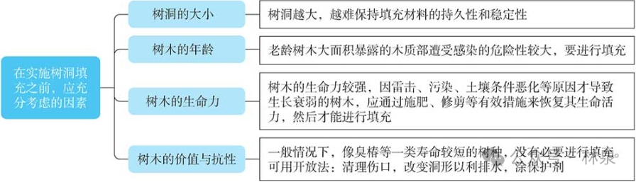
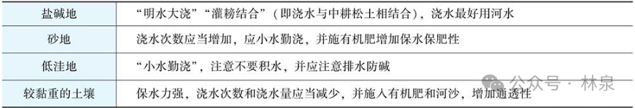

# 一般养护与管理
## 1.树体加固
主干或有中空，主枝常有死亡，造成树冠失去均衡，树体容易倾斜；又因树体衰老，枝条容易下垂，因而需用他物支撑。
> 如北京故宫御花园的龙爪槐，皇极门内的古松均用**钢管呈棚架式支撑**，钢管下端用**混凝土基加固**，干裂的树干用**扁钢箍起**，收效良好。
## 2. 树干疗伤
古树、名木进入衰老年龄后，对各种伤害的恢复能力减弱。
## 3. 树洞修补
古树、名木的伤口长久不愈合，长期外露的木质部**受雨水浸渍**，逐渐腐烂，形成树洞，既影响树木生长，又影响观赏效果，长期下去还有可能造成倒伏和死亡。
## 4. 设避雷针
高大的古树应加避雷针，如果遭受雷击应立即将**伤口刮平，涂上保护剂**。
## 5. 灌水、松土、施肥
春、夏干旱季节灌水防旱，秋、冬季浇水防冻，灌水后应松土，一方面保墒，同时也增加土壤的通透性。
>“墒”指的是土壤水分，农田的土壤湿度

古树施肥要慎重，一般在树冠投影部分开沟 （深0. 3m、宽0.7m、长2m或深0. 7m、宽1m、长2m），沟内施腐殖土加稀粪，或适量施化肥等增加土壤的肥力，但要严格控制肥料的用量，绝不能造成古树生长过旺，特别是原来树势衰弱的树木，如果在短时间内生长过盛会**加重根系的负担**，造成树冠与树干及根系的平衡失调，后果适得其反。
## 6. 树体喷水
由于城市空气浮尘污染，古树的树体截留灰尘极多，特别是在枝叶部位，不仅影响观赏效果，而且由于减少了叶片对光照的吸收而**影响光合作用**。可采用喷水方法加以清洗，此法**费工费水**，一般只在重点区采用。
## 7. 整形修剪
一般情况下，以基本保持原有树形为原则，尽量减少修剪量，避免增加伤口数。对病虫枝、枯弱枝、交叉重叠枝进行修剪时，应注意修剪手法，以**疏剪**（基部分枝处将枝梢全部剪除）为主，利于通风透光，减少病虫害滋生。进行更新、复壮修剪时，可适当**短截**（把枝条的一部分剪去），促发新枝。
## 8. 防治病虫害
古树衰老，容易招虫致病，加速死亡。应更加注意对病虫害的防治。
## 9. 设围栏、堆土、筑台
在人为活动频繁的立地环境中的古树，要设围栏进行保护。围栏一般要距树干3～4m，或在树冠的投影范围之外。对围栏外的地面也要作**透气性**的铺装处理；在古树干基堆土或砌台可起保护作用，也有**防涝**效果，砌台比堆土收效更佳，堆砌时应在台边留孔排水，切忌围栏造成根部积水。
## 10. 立标示牌
标明树种、树龄、等级、编号等，明确养护管理负责单位，设立宣传牌。
# 处理古树、名木的树洞
1. 干基的空洞都是由于机械损伤、动物啃食、和根颈病害引起的；
2. 大枝分叉处的空洞多源于劈裂和回缩修剪；
3. 根部空洞源于机械损伤，动物、真菌和昆虫的侵袭
主要步骤如下：
## 1. 树洞的清理
凿、刀具、木锤。树洞很大时，利用气动或电动凿等可大大提高工效。**从洞口开始**逐渐向内清除已经腐朽或虫蛀的木质部，已完全发黑变褐、松软的心材要去掉，要注意保护障壁层 （质地坚硬的部分，可能已变色）。对于基本愈合封口的树洞，最好保持不动，但为了抑制内部的进一步腐朽，可向洞内**注入消毒剂**。
## 2. 树洞的整形
### （1）树洞内部整形
主要是为了消灭水袋，**防止积水**。浅树洞应该切除洞口下方的外壳，使洞底向外向下倾斜。较深的树洞应该从树洞底部较薄洞壁的外侧树皮上，用电钻由下向内、向上**倾斜钻孔**，直达洞底的最低点。在孔中安置一个向下**排水管**，其出口稍突出树皮。如果树洞底部低于地面，难以排水，则应在树洞清理后，在洞内**填入理想的固体材料**，填充高度高于地表10～20cm，并向下倾斜，以利于排水出洞。
### （2）洞口整形
保持其健康的自然轮廓线，保持光滑而清洁的边缘。树洞周围树皮边沿的轮廓线应修整成基本**平行于树液流动方向**的长椭圆形或梭形开口，同时应尽可能保留边材，防止伤口形成层的干枯。如果伤口周围有已经切削整形的皮层幼嫩组织，应立即用**紫胶清漆涂刷**，保护形成层。
## 3. 树洞的加固
大树洞需要加固，加固可用螺栓或螺钉。在树洞两壁适当位置钻孔，所用螺栓或螺钉的长度和粗度应与其相符。把螺栓或螺钉插入孔中，将两边洞壁连接牢固。
应注意的问题如下
1. 钻孔的位置至少离伤口健康皮层和形成层带5cm。
2. 螺栓或螺钉的两头必须不突出形成层，以利于**愈伤组织覆盖表面**。
3. 所有的钻孔都要**消毒**，并用树木涂料覆盖。
## 4. 树洞的消毒和涂漆
消毒和涂漆是树洞处理的最后一道工序。在树洞清理后，用**木馏油**或**3%的硫酸铜溶液**涂抹树洞内外表面，进行消毒。然后，对**所有外露的木质部**涂漆。
## 5. 树洞的填充

# 古树复壮
古树、名木的共同特点是树龄较高、树势衰老，自体生理机能下降，根系吸收水分、养分的能力和新根再生的能力下降，树冠枝叶的生长速度也较缓慢，如遇外部环境的不适或剧烈变化，极易导致树体生长衰弱或死亡。
所谓更新复壮，就是运用科学合理的养护管理技术，使原本衰弱的树体重新恢复正常生长，延缓其衰老进程。必须指出的是，古树、名木更新复壮的运用是有前提的，它只对那些虽说年老体衰，但仍在其生命极限之内的树体有效。
## 1. 埋条促根
在古树根系范围内，填埋适量的树枝、熟土等有机材料，以改善**土壤的通气性**以及**肥力条件**，主要有放射沟埋条法和长沟埋条法。苹果、海棠、紫穗槐等树枝。麻酱渣（芝麻榨油以后的废料）、尿素。磷肥有动物骨头和贝壳。
## 2. 地面处理
采用根基土壤**铺梯形砖**、带孔石板或种植地被的方法，目的是改变土壤表面受人为踩踏的情况，使土壤能与外界保持正常的水汽交换。在铺梯形砖时，下层用沙衬垫，砖与砖之间不勾缝，留足透气通道。北京采用石灰、沙子、锯末配制比例为1∶1∶0.5的材料为衬垫，其他地方由于土壤pH值尽量不用石灰。采用栽植地被植物措施，对其下层土壤可作与上述埋条法相同的处理，并设围栏禁止游人踩踏。
## 3. 换土
如果古树、名木的生长位置由于受到地形、生长空间等立地条件的限制，而无法实施上述的复壮措施时，可考虑采用更新土壤的办法。
## 4. 病虫防治
1. 浇灌法 利用内吸剂通过**根系吸收**、经过输导组织至全树而达到杀虫、杀螨等作用的原理，解决古树病虫害防治经常遇到的**分散、高大、立地**条件复杂等情况而造成的喷药难以杀伤天敌、污染空气等问题。3～5个弧形沟，将药剂浇入沟内，渗完后封土。
2. 埋施法 利用**固体**的内吸杀虫、杀螨剂埋施根部的方法，以达到杀虫、杀螨和**长时间保持药效**的目的。方法与浇灌法相同，将固体颗粒均匀撒在沟内，然后覆土浇足水。
3. 注射法 对于周围环境复杂、障碍物较多，而且吸收根区很难寻找的古树，可以通过向树体内注射内吸杀虫、杀螨药剂，经过树木的**输导组织**至树木全身，以达到杀虫、杀螨的目的。
## 5. 化学药剂疏花疏果
当植物在**缺乏营养或生长衰退**时，常出现多花多果的现象，但大量结果会造成植物营养失调。采用药剂疏花疏果，则可降低古树的生殖生长，扩大营养生长，恢复树势而达到复壮的效果。疏花疏果的关键是**疏花**，喷药时间以秋末、冬季或早春为好。
## 6. 喷施或灌施生物混合制剂
采用生物混合制剂对古圆柏、古侧柏实施叶面喷施和灌根处理，可促进古柏枝、叶与根系的生长，增加枝叶中叶绿素及磷的含量，并增强其耐旱力。
## 7. 抗旱与浇水
生长在市区主要干道及烟尘密布、有害气体较多的工厂周围的古树、名木，影响树木的**光合作用**，需要定期，向树冠喷水，冲洗叶片，利于树木同化作用（光合作用），制造氧分，复壮树势。
浇水时一般要遵循以下原则：
1. 不同气候和不同埋藏对浇水和排水的要求有所不同。
2. 树种不同，年限不同浇水的要求也不同。
3. 根据不同的土壤情况进行浇水。

4. 浇水应与施肥、土壤管理等相结合。

名木、古树一般在春季和夏季要灌水防旱，秋季和冬季浇水防冻。如遇特殊干旱年份，则需根据树木的长势、立地条件和生活习性等具体情况进行抗旱，要特别注意以下几点：
1. 不要紧靠树干开沟浇水，需远离树干，最好至树冠投影外围进行，因吸取水分的根主要是**须根**，而主根只起支撑树木的作用。
2. **浇则浇透**，抗旱一定要彻底。可分几次浇，不要一次完成。大多数浇水应令其渗透到80～100cm深处。适宜的浇水量一般以达到土壤最大持水量的60%～80%为标准。一定要灌饱灌足，切忌表土打湿而底土仍然干燥。
3. 抗旱要连续不断，直至旱情解除为止，不要半途而废。
4. **坡地**要比平地多浇水。
## 8. 修剪、立支撑
1. 修剪 **死亡主枝**（树冠失去均衡，树体倾斜），**感染了病虫害的枝条**，**无用枝**（过多耗费了营养）。古树结合修剪进行疏花果处理，减少营养的不必要浪费。
2. 支撑 树体衰老，枝条容易下垂，需要进行支撑。
3. 复壮时 修去过密枝条，有利于通风，加强同化作用，且能保持良好树形。对衰弱的古树一定要控制树势，减轻重量。对已弯斜的或有明显危险的树干要立支撑保护，固定绑扎时要放垫料，以免发生缢束，以后酌情松绑。