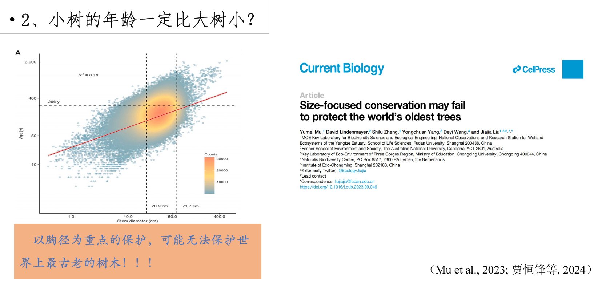
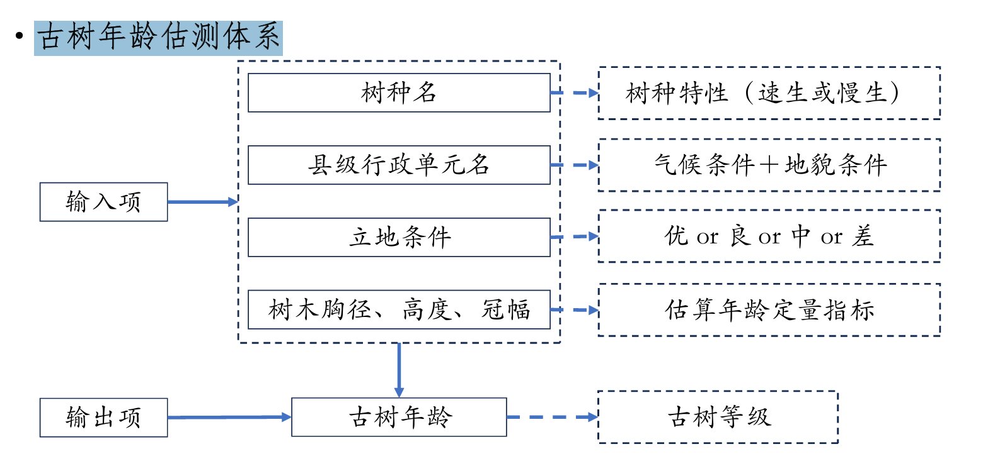

# 定义
古树：指树龄在百年以上的大树。
1. 一级古树：树龄500年以上
2. 二级古树：树龄在300-499年
3. 三级古树：树龄在100-299年
4. 全国普查范围内的古树名木共计508.19 万株，包括散生122.13万株和群状386.06 万株
# 树龄
## 树龄与树木大小

## 古树年龄鉴定方法
1. 访谈追踪法
2. 文献追踪法。调查方法简单、成本低，具有较大的误差，可作为古树年龄鉴定的辅助手段。
3. C14测定法。成本高，操作复杂，不能测活体样本； 对上千年的古树测定效果好。
4. CT扫描测定法。成本高，野外不方便携带； 适用于树干笔直且无中空的树木。
5. 回归模型法 生长速率：胸径-年龄之间的关系。树木年轮分析法具有树轮测量精确、分辨率高、连续性强、便于获取、定年准确等特点，能够较准 确地推算出古树的年龄，并且使用成本也相对较低。
## 采样原则
采样原则——覆盖气候类型 地质类型
采样方法——树木年轮学方法
利用树木生长锥共采集树芯样品577根，圆盘34个，共获取树木年轮序列600余条。
## 数据分析
1. 树木生长差异——树种特性。不同树种生长速率差异大
2. 气候(水热条件)影响区域。气候类型影响生长速率 但不影响生长规律
3. 立地条件。古树生长立地条件既生长速率又影响生长规律

年龄估测模型:
1. 指标 树木生长差异——树木(大小)胸径、高度、冠幅
2. 古树估测模型构建——单因子(温度—年轮宽度 降水—年轮宽度 胸径、高度、冠幅—树龄)
3. 多因子回归模型$$TRW = a_1\times Site+a_2 \times Temperature+a_3\times Precipitation+a_4\times Size+...+a_n\times Factor_n$$ $$\sum_{i=1}^na_i=1$$
4. 古树年龄估测体系
5. 古树年龄估测系统（快速 准确 APP 易操作 ）

