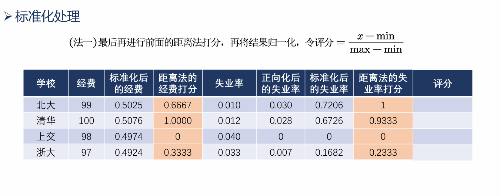
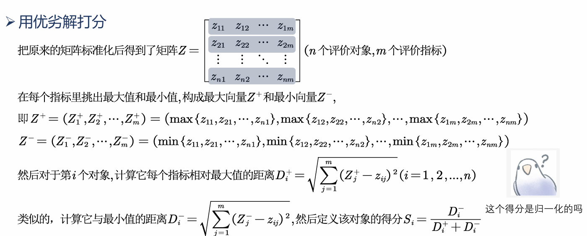
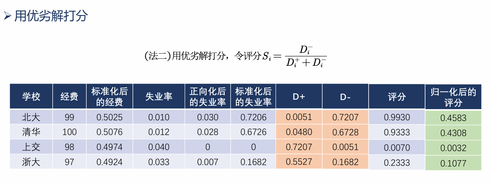
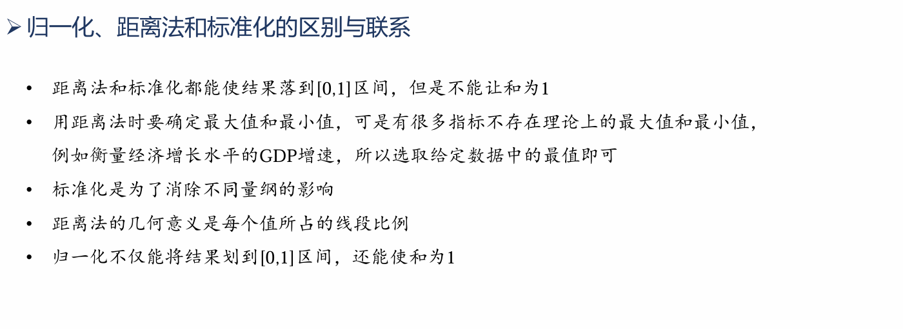
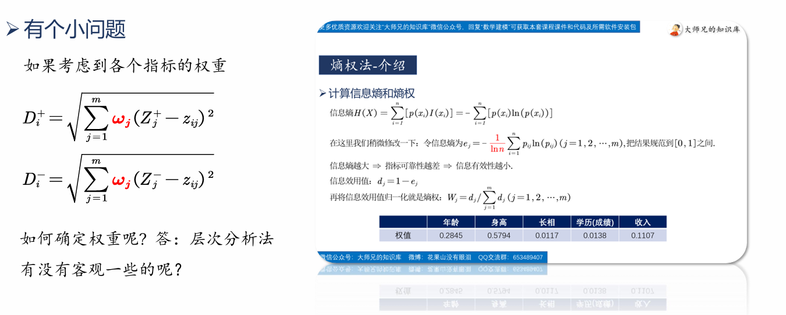

# 标准化矩阵
正向化与标准化
目的: 消除**量纲**的影响
# 距离法打分

# 用优劣解打分

上述得分$S_i$**不是归一化**的;
得分$S_i$**越大越好**.

# 核心思想
在各个指标中中出评价对象的最优解$Z^+$和最劣解$Z^-$,选择**靠近最优解而远离最劣解**的方案为最佳答案.
# 基于熵权法的TOPSIS
熵权法用于确定**指标权重**;
TOPSIS用于**评价模型**.
两者都最大程度地利用了数据本身,是**客观**的方法.
