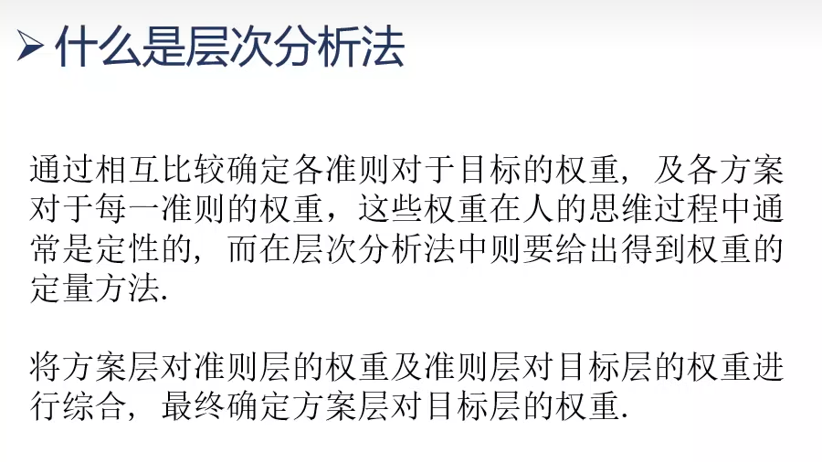
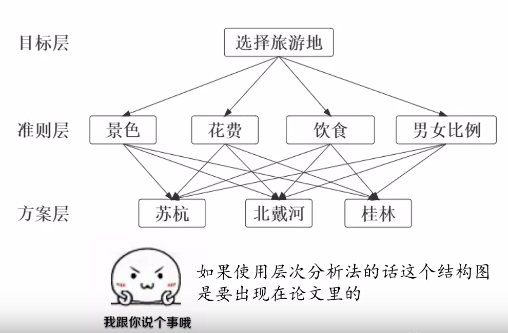
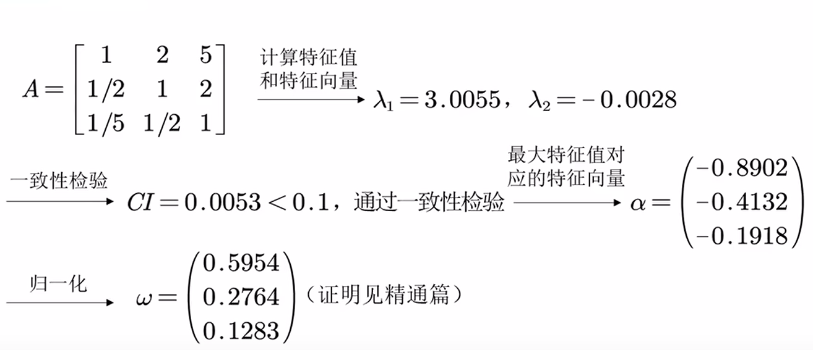

# 介绍
层次分析法是对评价类问题进行打分的一种方法
# 例题
唐僧师徒四人取经结束后打算组织一场佛法全国巡回演唱会,但对于第一场去苏杭,北戴河还是桂林产生了分歧.
一番讨论后,他们最关心的是一下问题: 景色优美,价格亲民,饮食情况,男女比例.
## 确定层级结构
评价目标: 选择演唱会地点.
评价标准: 景色优美,价格亲民,饮食情况,男女比例.
可选方案: 苏杭,北戴河,桂林等.
## 确定权重指标
|     | 指标权重 | 苏杭 | 北戴河 | 桂林 |
| --- | --- | --- | --- | --- |
| 景色 |
| 花费 |
| 饮食 |
| 男女比例 |
确定权重指标时,一般先**两两比较**,在上一组的比较基础上进而推断当前两组的权重.

| 尺度$a_{ij}$ | 含义 |
| --- | --- |
| $1$ | $C_i$与$C_j$的影响相同 |
| $3$ | $C_i$比$C_j$的影响稍强 |
| $5$ | $C_i$比$C_j$的影响强 |
| $7$ | $C_i$比$C_j$的影响明显强 |
| $9$ | $C_i$比$C_j$的影响绝对强 |
| $2,4,6,8$| $C_i$与$C_j$的影响之比在上述两个相邻等级之间|
|$1,\frac{1}{2},...,\frac{1}{9}$| $C_j$与$C_i$的影响之比为上面$a_{ij}$的相反数 |
## 用**两两比较法**确定指标重要性
|     | 景色 | 花费 | 饮食 | 男女比例 |
| --- | --- | --- | --- | --- |
| 景色 | 1 | 1/2 | 4 | 3 |
| 花费 | 2 | 1 | 5 | 5 |
| 饮食 | 1/4 | 1/5 | 1 | 1/4|
| 男女比例 | 1/3 | 1/5 | 4 | 1 |
$a_{ij}$表示矩阵第$i$行第$j$列的元素,含义为$i$相较$j$的重要程度;
$i=j$时规定$a_{ij}=1$;
当且仅当$a_{ij}>0,a_{ij}\times a_{ji}=1$时,该矩阵为**正互反矩阵**;
该矩阵即为层次分析法的**判断矩阵**,有了判断矩阵就可以求各个评判指标间的**权重向量**了;
## 确定待选方案在某一指标的得分
| 景色 | 苏杭 | 北戴河 | 桂林 |
| --- | --- | --- | --- |
| 苏杭 | 1 | 2 | 5 |
| 北戴河 | 1/2 | 1 | 2
| 桂林 |1/5 | 1/2 | 1 |
## 确定待选方案最终的得分
$$该方案的最终得分=\sum_{i}指标i得分\times指标i权重$$
# 定义
## 什么是层次分析法

## 矩阵一致性
| 景色 | 苏杭 | 北戴河 | 桂林 |
| --- | --- | --- | --- |
| 苏杭 | 1 | 2 | 5 |
| 北戴河 | 1/2 | 1 | 2
| 桂林 |1/5 | 1/2 | 1 |
$a_{12}=2$,即 $苏杭:北戴河=2:1$,
$a_{13}=5$,即 $苏杭:桂林=5:1$,
那么 $a_{23}=a_{21}\times a_{13}=\frac{1}{2}\times 5$,
与表格上 $a_{23}=2$ 矛盾,此时对应的判断矩阵就是不一致矩阵;
### 一致矩阵
满足 $a_{ij}\times a_{jk}=a_{ik}$ 的矩阵
一致矩阵具有两个性质
1. A的秩为1,且A具有唯一非零特征根n.
2. A的任一列向量都是对于特征根n的特征向量.

由性质1有,只要满足两两行/列成倍数关系就是一致性矩阵.
### 矩阵一致性的检验
使用判断矩阵前要检验其一致性,检验方法如下:
1. 正互反矩阵A的秩为1,A的唯一非零特征根为n.
2. 正互反矩阵A的任一列向量都是对于特征根n的特征向量.
3. 当正互反矩阵A不为一致阵时,其最大特征根$\lambda_{max}>n$,$\lambda+{max}$与$n$相差越大,其不一致程度越大.

计算一致性指标$C_i=\frac{\lambda_{max}-n}{n-1}$,$C_i=
\begin{equation}
\left\{
\begin{aligned}
0,有完全一致性 \\
接近0,满意的一致性\\
越大,一致性越差
\end{aligned}
\right.
\end{equation}
$
为了衡量$CI$的大小,引入**随机一致性指标**$RI$,先构造500个矩阵$A_1,A_2,...,A_{500}$
分别计算其$\lambda_{max}$,于是得到它们的一致性指标$CI_1,CI_2,...,CI_{500}$,定义一致性指标$$RI=\frac{(\frac{1}{500}\sum_{i=1}^{500}CI_i)-n}{n-1}$$
常用一致性指标如下表所示

| $n$ | 1 | 2 | 3 | 4 | 5 | 6 | 7 | 8 | 9 | 10 | 11 |
| --- | --- | --- | --- | --- | --- | --- | --- | --- | --- | --- | --- |
| $RI$ | 0 | 0 | 0.58 | 0.90 | 1.12 | 1.24 | 1.32 | 1.41 | 1.45 |1.49 | 1.51 |
定义一致性比例$CR=\frac{CI}{RI}$,如果$CR<0.1$,则可认为矩阵的一致性可以接受;否则需对判断矩阵进行修正.
以下为需要用到的两个公式:
$$一致性指标C_i=\frac{\lambda_{max}-n}{n-1},一致性比例CR=\frac{CI}{RI}$$
如果$CR>0.1$强行往一致性上靠,调整成倍数关系即可
## 指标权重的计算
### 一致性矩阵权重计算
对于一致矩阵,可直接将**归一化**的值作为权重
(某列中某值占该列所有值的比例)

| 景色 | 苏杭 | 北戴河 | 桂林 |
| --- | --- | --- | --- |
| 苏杭 | 1 | 2 | 4 |
| 北戴河 | 1/2 | 1 | 2
| 桂林 |1/4 | 1/2 | 1 |
如, $苏杭=\frac{1}{1+0.5+0.25}=0.5714$
### 非一致性矩阵权重计算 - 算术平均法求权重

| 景色 | 苏杭 | 北戴河 | 桂林 |
| --- | --- | --- | --- |
| 苏杭 | 1 | 2 | 5 |
| 北戴河 | 1/2 | 1 | 2
| 桂林 |1/5 | 1/2 | 1 |
此时,第一列 $苏杭=\frac{1}{1+0.5+0.2}=0.5882,桂林=\frac{0.2}{1+0.5+0.2}=0.1176$
第二列 $苏杭=\frac{2}{2+1+0.5}=0.5714$
第三列 $苏杭=\frac{5}{5+2+1}=0.6250$
算术平均值 $苏杭=\frac{0.5882+0.5714+0.6250}{3}=0.5949$
即权重 $\omega=[0.5949\ 0.2766\ 0.1285]^T$
## 判断矩阵的权重计算
### 计算方法
1. **论文表述**: 对于判断矩阵$A=[a_{ij}]$,先将其归一化,再将归一化的矩阵按列相加,并将每个元素除以n得到权重向量,即 $$\omega_i=\frac{1}{n}\sum_{j=1}^{n}\frac{a_{ij}}{\sum_{k=1}^{n}a_{kj}}\ (i=1,2,...,n)$$
2. **特征值法**求权重(重点) 
3. 在非一致性不大的情况下,算术平均法和特征值法算出的权重相差并不大,为了计算方便一般使用特征值法;为了凑字数也可以两种方法都用然后求平均值.
### 统计权重的结果 - 层次总排序
|     | 景色 | 花费 | 饮食 | 男女比例 |
| --- | --- | --- | --- | --- |
| 景色 | 1 | 1/2 | 4 | 3 |
| 花费 | 2 | 1 | 5 | 5 |
| 饮食 | 1/4 | 1/5 | 1 | 1/4|
| 男女比例 | 1/3 | 1/5 | 4 | 1 |
依照上述矩阵用特征值法算出指标的权重.

| 指标 | 景色 | 花费 | 饮食 | 男女比例 |
| --- | --- | --- | --- | --- |
| 权重 | 0.2910 | 0.5022 | 0.0648 | 0.1420 |
在与各个评价指标下各方案的权重汇总后得到表格:

|     | 指标权重$a_i$ | 苏杭$w_i$ | 北戴河 | 桂林 | $CI$ | $CR/\lambda$
| --- | --- | --- | --- | --- | --- | --- |
| 景色 | 0.2910 | 0.5954 | 0.2764 | 0.1283 | 0.0028 | 0.0053/3.0055 | 
| 花费 | 略
| 饮食 |
| 男女比例 |
| 得分$s_j$ |
可算出每一方案的得分为:
$$s_{苏杭}=\sum_{i=1}^{m}a_i\times w_{苏杭i}$$
最后进行层次总排序的检验,如果:
$$CR=\frac{\sum_{i=1}^{m}a_i\times CI_i}{\sum_{i=1}^{m}a_i\times RI_i}=0.0203<0.1$$
则通过一致性检验,我们最后的层次总排序是合理的.
# 总结
## 层次分析法的套路
1. 解决评价类问题
2. 画出层级结构图(目标层,准则层,方案层) (出现在论文里)
3. 构造判断矩阵
4. 依照评价指标对各个方案进行打分
5. 求出权重,填表,求最后得分
6. 层次总排序一致性检验
