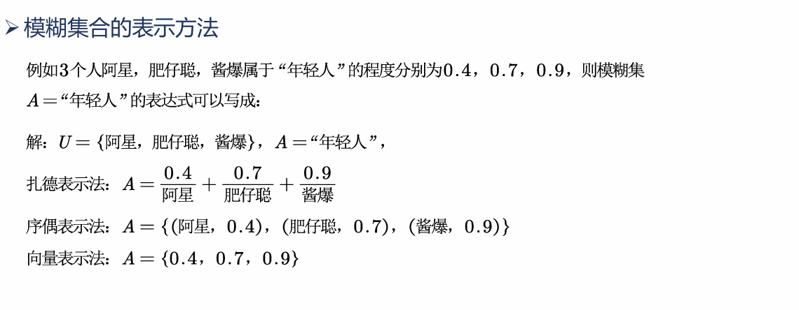

# 例题
斧头帮大哥想理个短发,剪完后二当家找茬说给大哥理成了秃子,为了避免被勒索,请你说服大哥是短发而不是秃子.
## 模糊的概念
不满足非此即彼得**排中律**,而具有亦此亦彼的模糊性.
随机不确定是因果律破损造成的，而模糊不确定是由于排中律破损造成的.
确定的量: 高等数学,线性代数
不确定的量: 随机性(概率论),灰色统计,模糊性
### 传统集合
互异性,无序性,逻辑性(每一个对象都能确定是不是某个集合的元素),完备性(所有满足条件的元素都在集合中),...
### 传统集合的特征函数
定义$U$为**论域**,$f_A$是$A$集合的**特征函数**,有:$f_a:U\rightarrow\{0\ 1\}$
论域可理解为要研究的集合,符号 $:$ 可理解为"作用于",上式的意义是将$U$这个论域映射到$\{0\ 1\}$这个集合内
### 模糊函数的隶属函数
模糊集合不具有传统集合的互异性,而是"亦此亦彼"的.

### 模糊集合的表示方法
对于论域$U=\{x_1\ x_2\ ... x_n\}$,模糊集合为$A$,隶属度为$A(x_i)$
扎德表示法: $A=\frac{A(x_1)}{x_1}+...+\frac{A(x_n)}{x_n}$ ,这里的 $+$ 号并非是相加的意思,而仅仅表示记法
序偶表示法: $\{(x_1,A(x_1)),...,(x_n,A(x_n)0\}$
向量表示法: $\{A(x_1),A(x_2),...,A(x_n)\}$


上图中的积分符号代表一种**累加关系**

## 隶属函数的确定方法
### 模糊统计法
发放问卷,让受试者对模糊问题进行描述并归类,用**隶属频率**(比例)定义隶属度.
比如评价电影好坏我们向n个人发放问卷,如果m个人认为好,那么这部电影对于<好>这个评语集的隶属度就是m/n.
### F分布确定隶属函数

先确定分类为极大型,极小型还是中间型.
极小型时,先通过$\mu_A(x)=1$的条件确定$a$,再通过合理的$\mu_A(x)$与$x$的对应关系确定其他常数,最后得出隶属函数.

### 三分法确定隶属函数 - 概率密度
# 模糊综合评价
## 定义
1. 说法一: 就是以模糊数学为基础,将一些边界不清,不易定量的因素定量化.
2. 说法二: 要把论域中的对象对应评语集中一个指定的评语.
3. 说法三: 将方案作为评语集并选择一个最优的方案.
## 模糊综合评价流程
1. 确定**因素集**: 如工作能力,工作业绩,沟通能力等,即 $U=\{u_1,u_2,...,u_n\}$.
2. 确定**评语集**: 如好,中等,差,很差等, 即 $V=\{v_1,v_2,...,v_m\}$.
3. 确定各因素的权重: 即重要程度 $A=\{a_1,a_2,...,a_n\}$且$\sum a_i=1$.对于权重的确定,如果题目没有给出数据则用**层次分析法**,如果给出了数据则用**熵权法**的TOPSIS,也可以不确定权重.
4. 确定综合模糊判断矩阵: 对指标$u_i$来说,对各个评语的隶属度为$V$上的模糊子集.对指标$u_i$的评判记作: $R_i=[r_{i1},r_{i2},...,r_{im}]$ ,其中 $r_{im}$ 表示指标$u_i$对评语$v_m$的隶属度.
## 单级模糊综合评价
### 评语带色彩型的模糊综合判断
|     | 好(评语集) | 中等 | 差 | 很差 |
| --- | --- | --- | --- | --- |
| 工作能力(因素集) | | | | |
| 工作业绩 | | | | |
| 沟通能力 | | | | |
```
R = [r11, r12, ..., r1m] = [R1]
	[...            ...]   [..]
    [rn1, rn2, ..., rnm]   [Rn]
   ```
其意义按行和列分别有不同的解释.
按行来说第一行代表该员工工作能力属于{好,中等,差,很差}的程度(隶属度).
按列来说第一列代表该员工的{工作能力,工作业绩,沟通能力}属于好的程度(隶属度).

上图中每一行隶属度之和为1的原因是采用了**模糊统计法**,隶属度之和的具体值需要看选取的隶属函数.

评判结果矩阵=权重矩阵\*模糊综合判断矩阵.
取结果**数值最大**的评语作为综合评判结果.
### 不带评价色彩的模糊综合判断


确定隶属函数时尽可能**归一化**(将值规范到[0, 1])

## 多级模糊综合评价
当因素集中指标过多时，会具有较高的相关性，我们可以将这些指标分类讨论:
每一组权重之和都**必须为1**.


比如对工作绩效做一次一级综合模糊评价就会得到工作绩效对评语集的隶属度的行向量,拼接即可.
对于有n个大因素集的问题,总共要确定n+1个权重矩阵,分别为每个因素集内部小因素的权重$A_i$,和这些因素集之间的权重$A$.
## 总结
### 模糊综合评价的套路
1. 解决评价类问题
2. 确定因素集(如果因素过多可考虑用多级，可以用主成分分析法,后面会讲),确定各因素权重,注意每一级权重之和为1
3. 确定评语集(有无评价色彩)
4. 从最后一层开始逐级确定每级因素对评语集的隶属度(逐级打分)
5. 根据隶属度确定相关评语(注意画图,如**直方图**)
### 小妙招
1. 确定各因素权重: 对于给定题目或课题中有数据的，直接用熵权法的TOPSIS(有些教材也称为变异系数法,后面会讲); 对于没有数据的,可以用层次分析法(过程简写，主次分明),然后在论文里写上**根据专家意见**即可.
2. 模糊综合评价真正拉开差距的点在于模型选取的合理与(例如因素集的选取); 另外,对于这种"没啥技术含量"的模型,可以用**图文并茂**的方法充实文章.