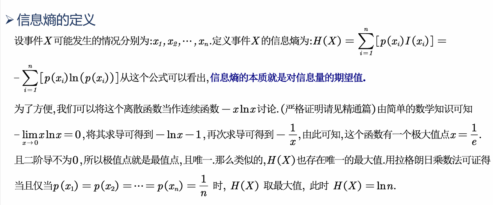
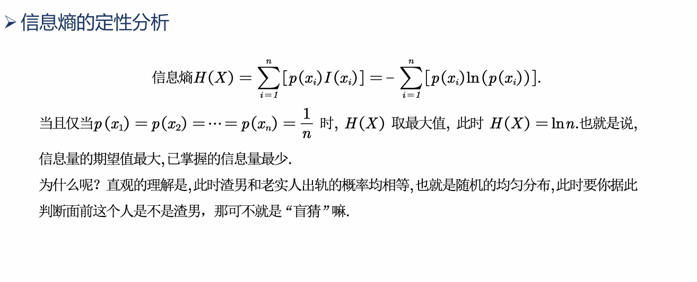
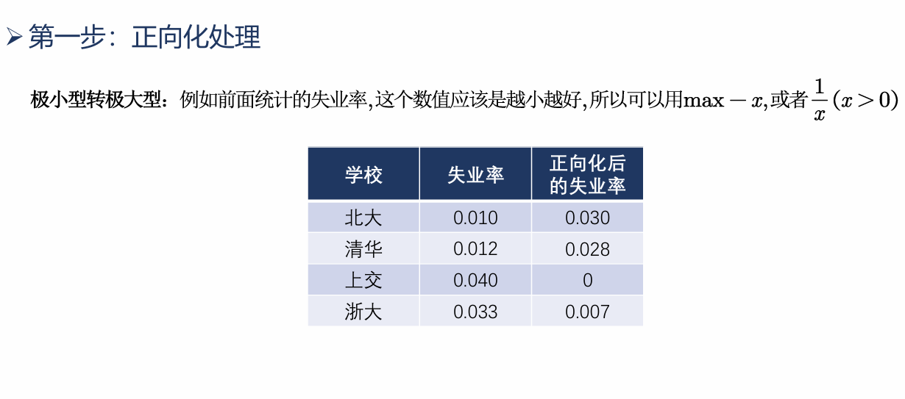
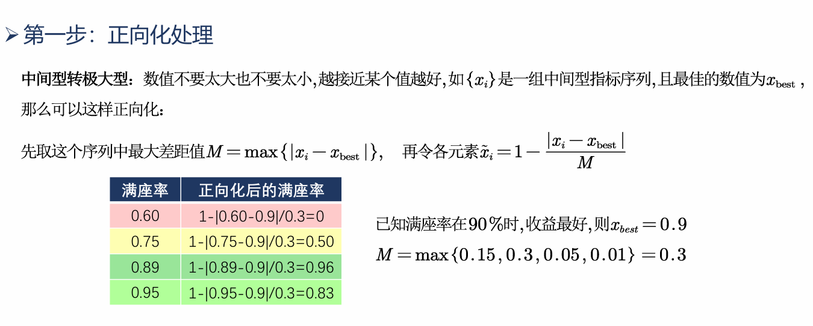
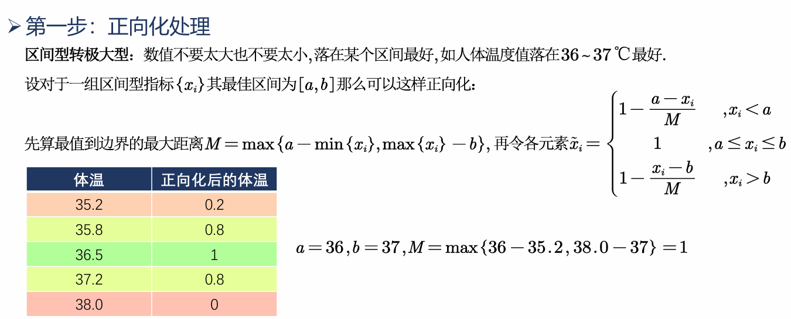
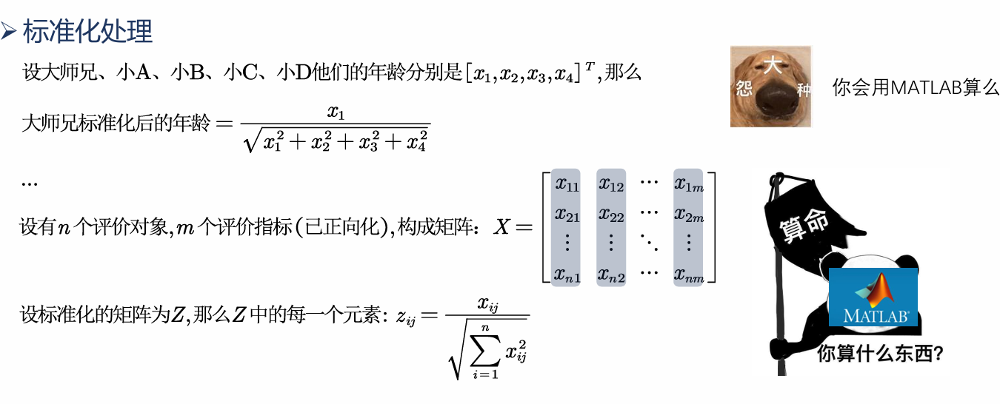
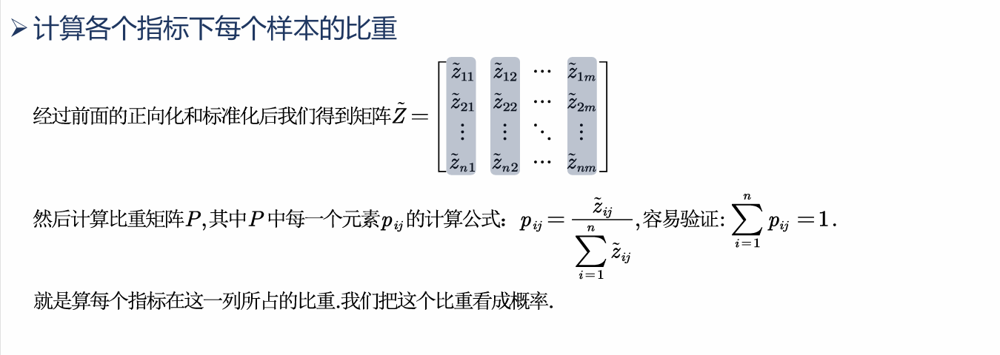
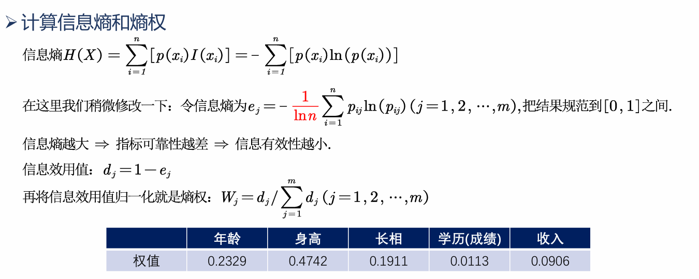

# 例题
相亲问题

|      | 年龄 | 身高 | 长相 | 学历 | 收入 |
| --- | --- | --- | --- | --- | --- |
| 大师兄 | 24 | 180 | 60 | 90 | 5000 |
| 小A | 23 | 175 | 90 | 85 | 10000 |
| 小B | 23 | 170 | 95 | 92 | 8000 |
| 小C | 24 | 185 | 81 | 100 | 5500 |
| 小D | 25 | 190 | 79 | 60 | 2000 |
**客观赋值**,就用熵权法
# 熵权法
## 概率与信息量的关系
老实人出轨概率小,话题度更高.
用出轨衡量渣男和老实人的策略不靠谱.
概率$P(x)$越小,**信息量**$I(x)$越大,原先掌握的信息越不靠谱; 反之亦然.
所以定义$I(x)=-ln(P(x))$
### 信息熵与信息量的关系
熵: 描述混乱程度的量纲.
信息熵: 平均发生一个事件我们获得的信息量的大小.
熵权法: 一种对**多对象,多指标**进行综合评价的方法,其评价依据来源于**数据本身**,几乎不受主观因素干扰.
其基本思想为: $信息熵小\rightarrow得到信息少,掌握的信息多\rightarrow这组信息更靠谱\rightarrow权重大$
### 信息熵的定义

## 步骤
### 正向化处理

### 标准化处理

